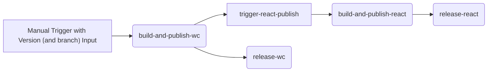

# Releasing Modus Web Components

This document outlines the steps to release a new version of the Modus Web Components library using the automated GitHub Actions workflows.

## Prerequisites

Ensure you have the necessary permissions to run the publishing workflow.

## Release Process

### 1. Prepare for Release

Ensure that all changes intended for the release are merged into the branch you are releasing from (`main`). This includes:
- Code changes
- Documentation updates

### 2. Trigger the Publish Workflow

1. Go to the `Actions` tab of the GitHub repository.
2. Select the pinned [Publish & Release](https://github.com/Trimble-Construction/poc-modus-wc-2.0/actions/workflows/publish.yml) workflow at the top.
3. Click on the `Run workflow` button to the right.
4. Provide the new version number as input and start the workflow.

### 3. Verify the Release

After the workflow completes, verify that the following have been successfully published:
- The `@trimble-cms/modus-wc` package to the NPM registry.
- The `@trimble-cms/modus-wc-react` package to the NPM registry.
- The [GitHub releases](https://github.com/Trimble-Construction/poc-modus-wc-2.0/releases) for both packages.

That's it! :octocat:

## GitHub Workflow Breakdown

The `Publish & Release` workflow will handle the following steps:
- Update the version in `package.json`.
- Build the `@trimble-cms/modus-wc` package.
- Publish the `@trimble-cms/modus-wc` package to the NPM registry.
- Trigger the `Publish & Release - React` workflow to publish the React package.
    - Update the version in `integrations/react/package.json`.
    - Build the `@trimble-cms/modus-wc-react` package.
    - Publish the `@trimble-cms/modus-wc-react` package to the NPM registry.
- Create GitHub releases for both packages.
