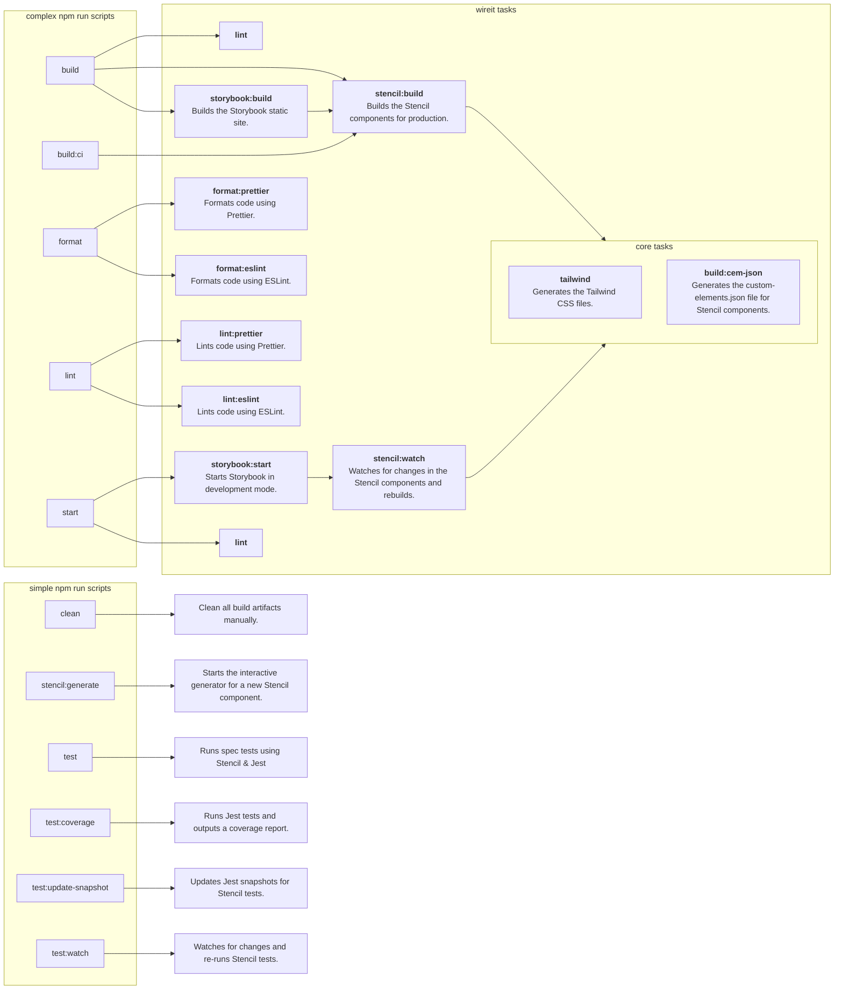

# Build Scripts

Here is a diagram of the build scripts in the project.

These scripts are defined in the `package.json` file and can be run using `npm run <script-name>`.

We use [wireit](https://github.com/google/wireit) to manage the complex build scripts and tasks in the project.
This allows us to have a more modular build system with explicit dependencies and caching.

There should be no need to run the internal tasks directly, as the high-level `npm run` scripts will take care of that for you.

All scripts on the left side of the chart can be run using `npm run <script-name>`.

