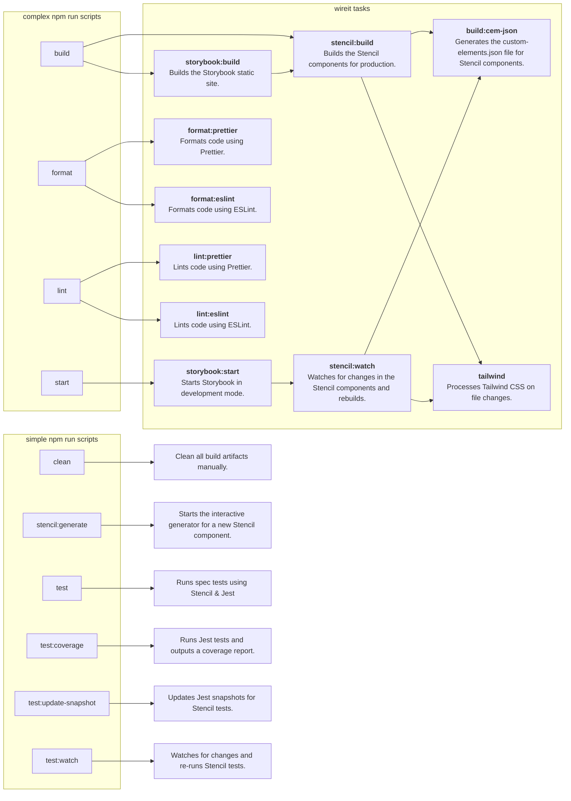

```mermaid
graph LR

    build --> stencil_build
    build --> storybook_build
    stencil_build --> build_cem_json
    stencil_build --> tailwind
    storybook_build --> stencil_build
    storybook_start --> stencil_watch
    stencil_watch --> build_cem_json
    stencil_watch --> tailwind
    format --> format_prettier
    format --> format_eslint
    lint --> lint_prettier
    lint --> lint_eslint
    start --> storybook_start
    clean --> desc0["Clean all build artifacts manually."]
    stencil:generate --> desc1["Starts the interactive generator for a new Stencil component."]
    test --> desc2["Runs spec tests using Stencil & Jest"]
    test:coverage --> desc3["Runs Jest tests and outputs a coverage report."]
    test:update-snapshot --> desc4["Updates Jest snapshots for Stencil tests."]
    test:watch --> desc5["Watches for changes and re-runs Stencil tests."]

    subgraph complex npm run scripts
        build
        format
        lint
        start
    end

    subgraph wireit tasks
        stencil_build["`
            **stencil:build**
            Builds the Stencil components for production.
        `"]
        storybook_build["`
            **storybook:build**
            Builds the Storybook static site.
        `"]
        build_cem_json["`
            **build:cem-json**
            Generates the custom-elements.json file for Stencil components.
        `"]
        stencil_watch["`
            **stencil:watch**
            Watches for changes in the Stencil components and rebuilds.
        `"]
        storybook_start["`
            **storybook:start**
            Starts Storybook in development mode.
        `"]
        tailwind["`
            **tailwind**
            Processes Tailwind CSS on file changes.
        `"]
        format_prettier["`
            **format:prettier**
            Formats code using Prettier.
        `"]
        format_eslint["`
            **format:eslint**
            Formats code using ESLint.
        `"]
        lint_prettier["`
            **lint:prettier**
            Lints code using Prettier.
        `"]
        lint_eslint["`
            **lint:eslint**
            Lints code using ESLint.
        `"]
    end

    subgraph simple npm run scripts
        clean
        stencil:generate
        test
        test:coverage
        test:update-snapshot
        test:watch
    end

```
