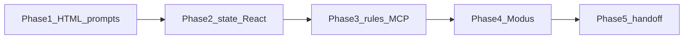

# Vibe Coding Enablement — Filled Workshop & Hackathon

Facilitator script for the five-phase curriculum: take product designers from **zero AI knowledge** to **production-ready in their circle** in about two days.

**What they ship:** live, state-driven prototypes for Product, and Modus-shaped repositories for Engineering.

**What they do not become:** application engineers. They do not need backends, auth, or to write React by hand.

Grounded in this library: `@trimble-oss/moduswebcomponents`, the React wrappers, Storybook docs, and the Modus Figma MCP guide.

---

## Production-ready (designer circle)

After Day 2 a designer can:

1. Chat and inline-edit in Cursor using English.
2. Reject static HTML “posters” and extra Figma frames as the handoff.
3. Name **state**, **props**, and **events** well enough to correct the AI.
4. Constrain generation to **Modus Web Components** (no custom CSS).
5. Point Cursor at a Figma node (MCP) instead of writing a visual essay.
6. Give Product a **live URL** and Engineering a **repo / PR**.

---

## Devices (not the spine)

Hands-on coding is a **laptop with Cursor**. iPad is optional.

| Task | Laptop + Cursor | iPad |
| --- | --- | --- |
| Figma frames, variants, copy URL | Yes | Yes |
| Chat / Cmd+K, `.cursorrules`, MCP JSON | Yes | No |
| Modus starter, `npm`, Git commit/PR | Yes | No |
| Open live preview URL | Yes | Yes |
| Watch a demo | Yes | Yes |

Someone on iPad-only can do Figma state exercises and review URLs. They are not production-ready until they sit at a laptop from Phase 1 onward.

---

## Two-day map

| When | PDF phase | Outcome |
| --- | --- | --- |
| Day 0 (45 min) | Preflight | Accounts and auth are green |
| Day 1 morning | Phase 1 | First UI from English, HTML/CSS only |
| Day 1 afternoon | Phase 2 | Frameworks + state + just enough React |
| Day 2 morning | Phases 3–4 | Rules, Figma MCP, Modus starter |
| Day 2 afternoon | Phase 5 + capstone | Git, live URL, scored mini-hack |



---

## Day 0 — Preflight (45 minutes, day before)

Do not spend Day 1 on logins.

**Attendee laptop**

1. Cursor installed and signed in.
2. GitHub can create a private repo.
3. Figma access to the **golden workshop file** (Modus 2.0 library instances only — custom components break MCP mapping). See [src/stories/modus-figma-mcp-integration-guide.mdx](../src/stories/modus-figma-mcp-integration-guide.mdx).
4. Node 20+ (`node -v`).

**Facilitator laptop (already done)**

1. A working Vite + React + Modus sandbox.
2. Figma MCP authenticated (Trimble Cloud token in `mcp.json`).
3. Sample `.cursorrules` (copy in Phase 3).
4. One hosting path chosen: Vercel, Netlify, or GitHub Pages.
5. Shared Slack/Teams thread titled “paste your preview URL.”

**Golden Figma file (build once)**

- Page A: login — variants Default / Disabled / Error / ModalOpen (not four unrelated frames).
- Page B: capstone — navbar, filter, table, confirm modal, empty/loading/error.
- Only Modus 2.0 library components.

**iPad:** confirm Figma access. Do not install Cursor here.

---

## Phase 1 — The magic of prompting (Day 1 morning, 90 min)

**Concept:** Zero constraints. English is the design tool.

**Say (5 min):** You are not learning to code. You are learning to **brief an intern who types infinitely fast**. Chat is conversation. Inline (`Cmd+K` / `Ctrl+K`) is “change this bit.”

### Demo (15 min)

Empty folder. No Git. No React.

**Prompt 1 — Chat**

```text
Create index.html and styles.css for a simple login page.
Email field, password field, Sign in button.
Clean layout, large enough to demo on a projector.
Do not use a JavaScript framework.
```

Open `index.html` in the browser (Cursor Simple Browser or Live Preview).

**Prompt 2 — Inline on the button**

```text
Make the Sign in button full width on small screens.
```

**Prompt 3 — Iterate, do not restart**

```text
Add a "Forgot password?" text link under the button. Keep the same page.
```

**Lesson:** Iterate. Do not open a new chat for every pixel.

### Lab (50 min) — pairs, laptops

Stay on **HTML/CSS only**. Each pair picks one:

- Login (if they want to follow the demo)
- Dashboard with three summary cards
- Settings page with a visible toggle (even if the toggle does not persist)

**Coach:** If the AI dumps React, say: “Plain HTML and CSS only. No framework yet.”

### Exit

- A visible UI they did not hand-type.
- They can point to Chat vs inline.

**iPad:** watch only.

---

## Phase 2 — Beyond static HTML: frameworks and state (Day 1 afternoon, 2.5 hr)

**Concept:** HTML/CSS is a poster. Real apps have **memory**. Frameworks are Lego. React is the vocabulary they will *read*, not write.

### 2a. Why the poster fails (25 min)

On the **same** HTML login, prompt:

```text
Add a success experience as a second HTML page named success.html.
After Sign in, go to that page.
```

**Figma parallel (any device):** two frames vs one component with variants Default / Disabled / Error / ModalOpen.

**Ask:** Which one is the product? **One screen, several memories.** Extra HTML pages = extra Figma frames. Fine for a picture. Wrong for Product and Engineering.

**iPad:** good for this Figma comparison.

### 2b. State in designer language (30 min)

State = the app’s memory **right now**.

| Designer already does | Tell the AI |
| --- | --- |
| Extra frames for open / closed | One screen. Keep `open` in state. |
| Disabled primary until the form is valid | `canSubmit` is false until fields are filled. |
| Error / empty / loading frames | Name those states in every prompt. |
| Prototype click → another frame | Click **updates state**; the same screen re-renders. |

Sticky drill: modal, password visibility, filter chip → write `isOpen`, `showPassword`, `activeFilter`.

**The sentence they must be able to say:**

> Add a state variable. When this button is clicked, update the state to open the modal.

### 2c. Why a framework (15 min)

| Poster (HTML) | Product (framework) |
| --- | --- |
| Duplicate markup per frame | One component, reuse like Figma symbols |
| Navigation between pages to fake interaction | Memory (`state`) on one screen |
| Custom CSS for every button | Shared blocks — at Trimble, **Modus** |

React, Angular, Vue, or plain custom elements can host Modus. This workshop uses **React** because Cursor’s default UI output is React and the Modus React wrappers exist (`@trimble-oss/moduswebcomponents-react`). They still prompt in English.

**Do not teach:** `useEffect`, context, Redux, routers, bundlers, TypeScript generics.

### 2d. Just enough React (60 min)

They must **recognize** four words:

| Word | Figma cousin | What it looks like |
| --- | --- | --- |
| Component | Component / symbol | A function that returns UI |
| Props | Component properties | `color="primary"` — a setting you pass in |
| State | Variants / prototype memory | `useState` — memory that changes |
| Event | Prototype trigger | `onClick` / `onButtonClick` — user did something |

**Live prompt:**

```text
Convert this HTML login into a single React component in a Vite app.
Do not add a second page.
Use useState for email, password, and whether the success modal is open.
Sign in sets open to true only if both fields are non-empty.
The Sign in control is disabled when either field is empty.
Close and overlay set open to false.
Do not use a design system yet.
```

**Read this out loud when the AI writes it:**

```tsx
const [email, setEmail] = useState('');
const [password, setPassword] = useState('');
const [open, setOpen] = useState(false);

const canSubmit = email.trim().length > 0 && password.trim().length > 0;

<button
  disabled={!canSubmit}
  onClick={() => setOpen(true)}
>
  Sign in
</button>

{open && (
  <div role="dialog">
    Success
    <button onClick={() => setOpen(false)}>Close</button>
  </div>
)}
```

Circle: `useState` = memory, `setOpen` = user acted, `{open && ...}` = show/hide, `disabled={!canSubmit}` = a variant driven by state.

**Lab:**

```text
Add a Show password control using state. Toggle the password field type between password and text.
Do not add a new page.
```

### Exit (Day 1)

They can point at AI output and say “that’s memory” vs “that’s a setting,” and they refuse two-page HTML as the handoff.

**Homework (10 min):** Prompt **loading** (button busy after click) and **error** (inline message if password is empty after submit). Bring the folder tomorrow.

**iPad:** cannot do 2d.

---

## Phase 3 — Wiring the AI brain (Day 2 morning, 50 min)

**Concept:** The model is only as good as rules + Figma + Modus docs.

### 3a. Project rules (20 min)

At the project root, create `.cursorrules` (or `.cursor/rules/modus.mdc`). Designers paste; they do not invent policy.

```text
You are helping a Trimble product designer vibe-code a prototype.

Components:
- Use only Modus Web Components (@trimble-oss/moduswebcomponents).
- Prefer React wrappers from @trimble-oss/moduswebcomponents-react when the app is React.
- Tags look like modus-wc-button, modus-wc-text-input, modus-wc-modal, modus-wc-table, modus-wc-navbar, modus-wc-toast.
- Do not invent native buttons, inputs, or tables when a Modus component exists.
- Do not write custom CSS or extra stylesheets. No hex colors. Use Modus themes and tokens.
- Theme: html class "light" data-theme="modus-modern-light" data-mode="light" unless asked for dark.
- Import '@trimble-oss/moduswebcomponents/modus-wc-styles.css'.
- Call defineCustomElements() from '@trimble-oss/moduswebcomponents/loader' once at app start if using raw custom elements.

State:
- One screen, not extra pages, for open/closed, loading, error, empty, disabled.
- Name state variables in the response (open, loading, error, query).
- Wire user actions to setState / events (buttonClick, inputChange).

Figma:
- When a Figma URL is provided, map library instances to modus-wc-* . Do not recreate custom drawings as new CSS.
```

**Lesson:** Rules stop the AI from hallucinating Bootstrap and custom CSS. If it still does, the rules were not in **this** folder or the prompt fought them.

### 3b. Figma MCP (25 min)

From [src/stories/modus-figma-mcp-integration-guide.mdx](../src/stories/modus-figma-mcp-integration-guide.mdx):

Cursor `mcp.json` (AUTH_TOKEN from Trimble Cloud app — preflight):

```json
{
  "modus_n8n_webhook": {
    "command": "npx",
    "args": [
      "mcp-remote",
      "https://flows-webhook.stage.trimble-ai.com/mcp/agentic/n8n-server/v1/modus",
      "--header",
      "Authorization: Bearer ${AUTH_TOKEN}"
    ],
    "env": {
      "AUTH_TOKEN": ""
    }
  }
}
```

Also enable the official **Figma MCP** in Cursor so the model can see the file.

**Accuracy rule (say this twice):** Use the **Modus 2.0 Figma library**. Custom components show up as undetected. Themes can still vary.

**Tools they will hear named (they do not call them by hand):**

- `analyze_figma` — page or node → suggested `modus-wc-*` mapping
- `get_modus_component_data` — props, events, slots for e.g. `modus-wc-table`

**Designer prompt (good):**

```text
Here is the Figma node for the login:
https://www.figma.com/design/<file>/<name>?node-id=<id>

Use Modus 2.0 components only. Implement states: empty, filled, disabled, error, modal open.
Do not write custom CSS.
```

**Designer prompt (bad):** “Make it look like this screenshot.”

Optional: attach the FIGMA_CODE_SPEC linked from the integration guide.

### Exit

Each laptop has `.cursorrules` and can paste a Figma URL into Chat.

**iPad:** copy Figma URL. Cannot edit `mcp.json`.

---

## Phase 4 — Building the Trimble way (Day 2 morning–midday, 80 min)

**Concept:** Company vehicle. Trust Modus for tokens, buttons, and modal behavior. Designers still own **which states exist**.

### 4a. One-step starter (the PDF “CLI prompt”)

This repo is the **library**, not an app generator. The designer-facing one-step is a **Cursor prompt** in an empty folder (facilitator can pre-run it):

```text
Scaffold a Vite + React + TypeScript app.
Install @trimble-oss/moduswebcomponents and the matching @trimble-oss/moduswebcomponents-react package for this React version.
Import '@trimble-oss/moduswebcomponents/modus-wc-styles.css'.
Set the document theme to modus-modern-light (html class light, data-theme, data-mode).
Create a blank App that only renders a modus-wc-button label "Ready".
Do not add extra CSS files.
Follow .cursorrules.
```

Lock versions (from getting started): do not float on “latest” in a real product; for the workshop, pinning whatever `npm` resolves that morning is enough.

**Raw custom elements (if not using the React package):**

```js
import { defineCustomElements } from '@trimble-oss/moduswebcomponents/loader';
defineCustomElements();
```

```html
<modus-wc-button color="primary" variant="filled">Click me</modus-wc-button>
```

**React wrapper (preferred in this workshop):**

```tsx
import { ModusWcButton } from '@trimble-oss/moduswebcomponents-react';

<ModusWcButton color="primary" aria-label="Sign in">
  Sign in
</ModusWcButton>;
```

### 4b. Rebuild yesterday’s login in Modus (45 min)

**Prompt:**

```text
Rebuild the login using only Modus components.
- modus-wc-text-input for email (type email, label Email) and password (type password)
- modus-wc-button for Sign in (disabled when fields are empty; color primary)
- modus-wc-modal for success (modal-id login-success). Open with the dialog showModal() on the element with that id; close with close().
- Keep useState for email, password, open.
- Controlled inputs: value + onInputChange, reading e.detail.target.value
- No custom CSS. No native <input> or <button>.
```

**Why this prompt is specific** (research from this repo — facilitators should know; designers only need the prompt):

- Button: `color` (`primary` …), `variant` (`filled` | `outlined` | `borderless`), `disabled`, `fullWidth`, event `buttonClick` (not only `onClick` on the host).
- Text input: `label`, `type`, `value`, events `inputChange` / `inputBlur`. React controlled pattern is documented in [src/stories/frameworks/react.mdx](../src/stories/frameworks/react.mdx).
- Modal: **not** an `opened` prop. Native `<dialog>`: `document.getElementById(modalId).showModal()` and `.close()`. Slots: `header`, `content`, `footer`. Required `modalId`.
- Theme: `data-theme="modus-modern-light"` (default) or dark / classic / connect — [src/stories/getting-started.mdx](../src/stories/getting-started.mdx).

If the AI writes a `<style>` block: “Delete custom CSS. Use Modus tokens and components only.” That is a rules miss, not a designer failure.

**Lab:** Error via input `feedback`, or `modus-wc-toast`. Loading: disable the button and change its label to “Signing in…”.

### Exit

Login looks like Trimble. Modal open/close is state + `showModal`. No custom CSS.

**iPad:** hold Figma next to the projector. Cannot run Vite.

---

## Phase 5 — Collaboration and delivery (Day 2 afternoon, 50 min)

**Concept:** Git is a shared folder with history. They do not read backend files.

### Saving (20 min)

| Word | Meaning |
| --- | --- |
| Repository | The master folder on GitHub |
| Commit | A named snapshot (“Add login modal state”) |
| Branch | A side copy for one idea |
| Pull request | “Please take this into the main folder” |

**In Cursor Source Control (the UI, not the terminal):**

1. `Publish Branch` / create repo.
2. Commit: `Add Modus login with modal state`.
3. New branch: `workshop/login-states`.
4. Commit again after a small change so history has more than one lump.

**Say:** You can ignore folders like `node_modules`. Engineers will ignore nothing important if your commits are small and named.

### For Product (15 min)

Deploy the interactive prototype (pre-chosen host). **Live URL in a real browser.** Localhost and Figma prototype links score lower in the hackathon.

Paste the URL in the shared thread. Open it on a phone or iPad to prove it.

### For Engineering (10 min)

Open a Pull Request. Description template they can paste:

```text
Prototype: login + success modal.
States: empty, disabled, error, open.
Modus: text-input, button, modal.
Not wired to real auth. Please connect API.
```

Engineers take Modus-compliant structure and attach databases. Designers do not explain Redux.

**iPad:** open the live URL. Cannot commit or PR from Cursor.

---

## Capstone / hackathon (90 min same day, or a third half-day)

Tests the **lifecycle**, not the prettiest mock.

**Brief (read aloud):**

> A PM reviews a list of items, filters them, and confirms an action in a modal. Include empty, loading, and error. Use only Modus Web Components. Deliver a live URL and a GitHub repo / PR.

**Suggested mapping (so the AI is not guessing):**

- `modus-wc-navbar`
- `modus-wc-text-input` with `include-search` for the filter (`query` state)
- `modus-wc-table` with `columns` + `data` (filter `data` in state; do not fake a second page)
- `modus-wc-modal` + `showModal()` for confirm
- `modus-wc-button` in the footer (primary confirm, tertiary cancel)
- `modus-wc-toast` or table empty state for error / empty

**Figma:** Page B of the golden file. Paste the node URL. Rules on.

### Judging (from the base PDF, filled)

| Criterion | Measures | Pass | Fail |
| --- | --- | --- | --- |
| AI orchestration and context | Phases 1 and 3 | Figma URL or MCP used; prompts name state (`query`, `open`, `loading`, `error`) | Screenshot-only prompting; two HTML pages |
| Modus fidelity and framework | Phases 2 and 4 | Strictly `modus-wc-*`; theme tokens; `.cursorrules` blocked custom CSS | Native inputs, Bootstrap, hex CSS |
| Repository management | Phase 5 engineering | GitHub repo, logical commits, engineer could pick up | Zip file, one giant “stuff” commit, no remote |
| Production delivery | Phase 5 product | Live clickable URL | Static screens, Figma-only, localhost-only |

Roaming judges: one PM (can they validate UX in the URL?) and one engineer (could they wire data from this PR?).

---

## Pocket card (print)

**You own:** problem, UX, states, accessibility, Modus fidelity, prompts, Figma context, prototype URL, clean PR.

**You escalate:** data, auth, performance, infra, “the AI keeps fighting the design system” (rules / MCP / library instances).

**Always name:** empty, filled, disabled, loading, error, success / open.

**Bad:** “Design the modal open and closed as two screens.”  
**Good:** “One screen. State `open`. Sign in sets true. Close and overlay set false. `modus-wc-modal` and `showModal()`.”

**Bad:** “Make it look like the Figma.”  
**Good:** “Here is the Figma node. Map to Modus 2.0. Props for `color` / `disabled`. State for modal and validation. No custom CSS.”

---

## Knowledge bar

| Must recognize | Skip |
| --- | --- |
| Chat vs `Cmd+K` | Hand-writing React |
| HTML as a poster | CSS architecture, Tailwind internals |
| `useState`, props, events | `useEffect`, context, Redux |
| `modus-wc-*` names via AI + Storybook | Stencil, Shadow DOM, this monorepo |
| `showModal()` / `close()` on the modal id | Implementing focus traps |
| Commit, branch, preview URL | CI, backends, tokens beyond pasting AUTH_TOKEN |

---

## Facilitator failure modes

- **Auth on Day 1** — burns Phase 1 magic. That is why Day 0 exists.
- **Teaching React like a bootcamp** — they freeze. Four words only.
- **Custom Figma components** — MCP looks “broken.” Fix the file, not the designer.
- **Letting custom CSS slide** — hackathon Modus fidelity fails. Push back to rules.
- **iPad as the coding device** — Cursor labs will fail. Borrow a laptop.
- **No live host** — everyone ends on localhost and fails Production Delivery.

---

## Pointers in this repo

- Getting started (install, theme, `defineCustomElements`): [src/stories/getting-started.mdx](../src/stories/getting-started.mdx)
- React wrappers and controlled `ModusWcTextInput`: [src/stories/frameworks/react.mdx](../src/stories/frameworks/react.mdx)
- Themes: [src/stories/styling.mdx](../src/stories/styling.mdx)
- Figma MCP, `analyze_figma`, `get_modus_component_data`: [src/stories/modus-figma-mcp-integration-guide.mdx](../src/stories/modus-figma-mcp-integration-guide.mdx)
- Modal `showModal()` pattern: [src/components/modus-wc-modal/modus-wc-modal.stories.ts](../src/components/modus-wc-modal/modus-wc-modal.stories.ts)
- Button / input / table / toast APIs: component `readme.md` files under `src/components/`
