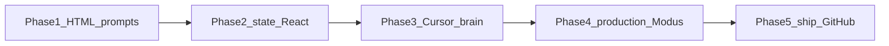

# Vibe Coding Enablement — Filled Workshop & Hackathon

Facilitator script for the five-phase curriculum: take product designers from **zero AI knowledge** to **better designers with AI** in about two days, by **vibe-coding on their own Macs**.

**How it runs:** Every attendee has a Mac and Cursor. They prompt, run, and iterate **their own** prototype the whole time. You project and coach. An iPad is optional for *you* — a big Figma canvas to explain frames vs state — not a device for them.

**What they ship:** live, state-driven prototypes for Product, and Modus-shaped repositories for Engineering.

**What they do not become:** application engineers. They do not need backends, auth, or to write React by hand. They become the designer who can **prove UX in a running Trimble UI**.

Grounded in this library: `@trimble-oss/moduswebcomponents`, the React wrappers, Storybook docs, and the Modus Figma MCP guide.

---

## Production-ready (designer circle)

After Day 2 a designer can:

1. Chat and inline-edit in Cursor using English.
2. Reject static HTML “posters” and extra Figma frames as the handoff.
3. Name **state**, **props**, and **events** well enough to correct the AI.
4. **Wire Cursor’s brain** — rules, a skill, Figma MCP, Modus docs MCP — so the model stops guessing.
5. Connect **production-grade Modus** (`@trimble-oss/moduswebcomponents`), not a generic UI kit.
6. **Ship from their own GitHub account** — repo, commits, PR, live URL.

---

## Room setup

**Everyone:** Mac + Cursor. They vibe-code from Phase 1 through ship. No pairing required; sitting together is fine, but each person owns a folder and a GitHub repo.

**Facilitator iPad (optional):** AirPlay or pass around Figma to *show* two frames vs variants vs one prototyped screen. Do not put Cursor on it. If you have no iPad, Figma on the Mac projector is enough.

---

## Two-day map

| When | PDF phase | Outcome |
| --- | --- | --- |
| Day 0 (45 min) | Preflight | Accounts and auth are green |
| Day 1 morning | Phase 1 | First UI from English, HTML/CSS only |
| Day 1 afternoon | Phase 2 | Frameworks + state + just enough React |
| Day 2 morning | Phase 3 | Cursor **brain**: rules, skills, Figma MCP, Modus MCP |
| Day 2 midday | Phase 4 | Production-grade Modus on that brain |
| Day 2 afternoon | Phase 5 + capstone | Ship with **their GitHub account** |



Day 2 in one sentence: **brain first, then the company vehicle, then their GitHub.**

---

## Day 0 — Preflight (45 minutes, day before)

Do not spend Day 1 on logins.

**Each attendee Mac**

1. Cursor installed and signed in.
2. GitHub account that can create a repo; they will connect it inside Cursor on Day 2.
3. Figma access to the **golden workshop file** (Modus 2.0 library instances only — custom components break MCP mapping). See [src/stories/modus-figma-mcp-integration-guide.mdx](../src/stories/modus-figma-mcp-integration-guide.mdx).
4. Node 20+ (`node -v`).

**Facilitator Mac (already done)**

1. A working Vite + React + Modus sandbox.
2. Demo of Cursor signed into GitHub (attendees will use **their** account on Day 2).
3. Figma MCP + Modus docs MCP authenticated where tokens are required.
4. Sample rules + skill from [workshop-kit](workshop-kit/).
5. One hosting path that logs in with GitHub: GitHub Pages or Vercel.
6. Shared Slack/Teams thread titled “paste your preview URL.”

**Golden Figma file (build once)**

- Page A: login — variants Default / Disabled / Error / ModalOpen (not four unrelated frames).
- Page B: capstone — navbar, filter, table, confirm modal, empty/loading/error.
- Only Modus 2.0 library components.

**Facilitator iPad (optional):** open the golden Figma file for the Phase 2 “frames vs state” walkthrough. Attendees still follow on their Macs.

---

## Phase 1 — The magic of prompting (Day 1 morning, 90 min)

**Concept:** Zero constraints. English is the design tool.

**Say (5 min):** You are not becoming developers. You are becoming **better designers with AI** — you run the prototype, you judge the UX, you prompt the next change. Chat is conversation. Inline (`Cmd+K` / `Ctrl+K`) is “change this bit.” Everyone does this in their own Cursor window.

### Demo (15 min)

Empty folder. No Git. No React.

**Prompt 1 — Chat**

```text
Create index.html and styles.css for a simple login page.
Email field, password field, Sign in button.
Clean layout, large enough to demo on a projector.
Do not use a JavaScript framework.
```

Open `index.html` in the browser (Cursor Simple Browser or Live Preview).

**Prompt 2 — Inline on the button**

```text
Make the Sign in button full width on small screens.
```

**Prompt 3 — Iterate, do not restart**

```text
Add a "Forgot password?" text link under the button. Keep the same page.
```

**Lesson:** Iterate. Do not open a new chat for every pixel.

### Lab (50 min) — everyone in their own Cursor

Stay on **HTML/CSS only**. Each person picks one:

- Login (if they want to follow the demo)
- Dashboard with three summary cards
- Settings page with a visible toggle (even if the toggle does not persist)

**Coach:** If the AI dumps React, say: “Plain HTML and CSS only. No framework yet.”

### Exit

- A visible UI they did not hand-type.
- They can point to Chat vs inline.

**Facilitator iPad:** put it down. They should be looking at *their* browser preview.

---

## Phase 2 — Beyond static HTML: frameworks and state (Day 1 afternoon, 2.5 hr)

**Concept:** HTML/CSS is a poster. Real apps have **memory**. Frameworks are Lego. React is the vocabulary they will *read*, not write.

### 2a. Why the poster fails (25 min)

On the **same** HTML login, prompt:

```text
Add a success experience as a second HTML page named success.html.
After Sign in, go to that page.
```

**Figma parallel (facilitator iPad or projector):** two frames vs one component with variants Default / Disabled / Error / ModalOpen. Then they immediately do the same idea in **their** HTML folder.

**Ask:** Which one is the product? **One screen, several memories.** Extra HTML pages = extra Figma frames. Fine for a picture. Wrong for Product and Engineering.

### 2b. State in designer language (30 min)

State = the app’s memory **right now**.

| Designer already does | Tell the AI |
| --- | --- |
| Extra frames for open / closed | One screen. Keep `open` in state. |
| Disabled primary until the form is valid | `canSubmit` is false until fields are filled. |
| Error / empty / loading frames | Name those states in every prompt. |
| Prototype click → another frame | Click **updates state**; the same screen re-renders. |

Sticky drill: modal, password visibility, filter chip → write `isOpen`, `showPassword`, `activeFilter`.

**The sentence they must be able to say:**

> Add a state variable. When this button is clicked, update the state to open the modal.

### 2c. Why a framework (15 min)

| Poster (HTML) | Product (framework) |
| --- | --- |
| Duplicate markup per frame | One component, reuse like Figma symbols |
| Navigation between pages to fake interaction | Memory (`state`) on one screen |
| Custom CSS for every button | Shared blocks — at Trimble, **Modus** |

React, Angular, Vue, or plain custom elements can host Modus. This workshop uses **React** because Cursor’s default UI output is React and the Modus React wrappers exist (`@trimble-oss/moduswebcomponents-react`). They still prompt in English.

**Do not teach:** `useEffect`, context, Redux, routers, bundlers, TypeScript generics.

### 2d. Just enough React (60 min)

They must **recognize** four words:

| Word | Figma cousin | What it looks like |
| --- | --- | --- |
| Component | Component / symbol | A function that returns UI |
| Props | Component properties | `color="primary"` — a setting you pass in |
| State | Variants / prototype memory | `useState` — memory that changes |
| Event | Prototype trigger | `onClick` / `onButtonClick` — user did something |

**Live prompt:**

```text
Convert this HTML login into a single React component in a Vite app.
Do not add a second page.
Use useState for email, password, and whether the success modal is open.
Sign in sets open to true only if both fields are non-empty.
The Sign in control is disabled when either field is empty.
Close and overlay set open to false.
Do not use a design system yet.
```

**Read this out loud when the AI writes it:**

```tsx
const [email, setEmail] = useState('');
const [password, setPassword] = useState('');
const [open, setOpen] = useState(false);

const canSubmit = email.trim().length > 0 && password.trim().length > 0;

<button
  disabled={!canSubmit}
  onClick={() => setOpen(true)}
>
  Sign in
</button>

{open && (
  <div role="dialog">
    Success
    <button onClick={() => setOpen(false)}>Close</button>
  </div>
)}
```

Circle: `useState` = memory, `setOpen` = user acted, `{open && ...}` = show/hide, `disabled={!canSubmit}` = a variant driven by state.

**Lab:**

```text
Add a Show password control using state. Toggle the password field type between password and text.
Do not add a new page.
```

They run this in their own folder. Coach by walking the room, not by coding for them.

### Exit (Day 1)

They can point at AI output and say “that’s memory” vs “that’s a setting,” and they refuse two-page HTML as the handoff.

**Homework (10 min):** Prompt **loading** (button busy after click) and **error** (inline message if password is empty after submit). Bring the folder tomorrow.

---

## Phase 3 — Cursor’s brain (Day 2 morning, 70 min)

**Concept:** A blank Cursor is a smart intern with amnesia. The **brain** is everything you attach so it remembers Trimble: rules, skills, MCPs (especially Figma), and @-context. Do this **before** production Modus, or the model will invent Bootstrap.

**Say:** You do not memorize APIs. You **install a brain**, then you talk.

### What in Cursor actually helps a designer

| Cursor thing | What it is | Designer job |
| --- | --- | --- |
| **Chat** | Conversation with the whole folder | “Build / change this screen” |
| **Inline `Cmd+K` / `Ctrl+K`** | Edit the bit under the cursor | “Make this button disabled until…” |
| **Agent vs Ask** | Agent edits files; Ask only answers | Use Agent to build; Ask to “what is state?” |
| **@Files / @Folders** | Point at a screen or `App.tsx` | Prefer this over “look at my project” |
| **@Web** | Fetch a public doc URL | Storybook page if MCP is down |
| **Rules** | Always-on policy for this repo | Stop custom CSS and extra pages |
| **Skills** | Playbook the agent reads for a job | “When I say implement Figma, do X” |
| **MCP** | Live tools (Figma, Modus docs) | See the file; look up real props |
| **Docs indexing** | Cursor reads the folder | Keep rules/skills **in this project** |
| **Source Control** | Git UI | Phase 5 — their GitHub |

Ignore for this workshop: terminal-first Git, CI, Bugbot, Stencil internals.

Copy-paste kit: [docs/workshop-kit](workshop-kit/).

### 3a. Rules — the always-on brain (20 min)

Rules fire on every chat. If they are missing, Modus will leak.

**Where:** project `.cursor/rules/modus-designer.mdc` (preferred) or `.cursorrules`. User-level Cursor Settings → Rules is optional extra; **project rules travel with the repo** so Engineering gets the same brain.

Paste [workshop-kit/modus-designer.mdc](workshop-kit/modus-designer.mdc). Frontmatter `alwaysApply: true` matters.

**Demo:** Ask for a button **without** rules (native `<button>` + CSS). Drop the rule file in. Same prompt → `modus-wc-button`, no hex.

**If the AI still fights you:** the folder you opened is not the folder with the rules. File → Open Folder on the prototype.

### 3b. Skills — the playbook (15 min)

A **skill** is a `SKILL.md` the agent follows for a kind of task (implement from Figma, add a modal state). Rules say *always*. Skills say *when doing this job*.

Drop [workshop-kit/modus-vibe/SKILL.md](workshop-kit/modus-vibe/SKILL.md) at `.cursor/skills/modus-vibe/SKILL.md`.

**Designer line after that:**

```text
Use the modus-vibe skill. Implement this Figma node with Modus only.
```

They do not write the skill. Facilitator ships it in the kit.

### 3c. MCP — Figma plus Modus docs (30 min)

MCP = plugins that let Cursor **call tools** (see a file, look up a component). Designers paste URLs; they do not call tool names.

**1. Official Figma MCP** (Cursor Settings → MCP, Figma). Sign in with the same Figma account as the golden file. This is how the model *sees* layout instead of a 400-word description.

**2. Modus Figma mapper** (Trimble) — from [src/stories/modus-figma-mcp-integration-guide.mdx](../src/stories/modus-figma-mcp-integration-guide.mdx). Maps library instances to `modus-wc-*`.

```json
{
  "modus_n8n_webhook": {
    "command": "npx",
    "args": [
      "mcp-remote",
      "https://flows-webhook.stage.trimble-ai.com/mcp/agentic/n8n-server/v1/modus",
      "--header",
      "Authorization: Bearer ${AUTH_TOKEN}"
    ],
    "env": {
      "AUTH_TOKEN": ""
    }
  }
}
```

`AUTH_TOKEN` is a Trimble Cloud app token (Day 0). Tools they may see in the log: `analyze_figma`, `get_modus_component_data`.

**3. Modus docs MCP** — `@trimble-oss/moduswebcomponents-mcp` (`get_modus_component_data`, `get_modus_implementation_data`). This is production docs (props, events, React/Angular guides), not a screenshot guess.

```json
{
  "modus-wc": {
    "command": "npx",
    "args": ["-y", "@trimble-oss/moduswebcomponents-mcp"]
  }
}
```

**Accuracy rule (say twice):** Figma file must use the **Modus 2.0 library**. Custom components show as undetected. Themes can still vary.

**Good prompt:**

```text
Here is the Figma node:
https://www.figma.com/design/<file>/<name>?node-id=<id>

Use Figma MCP + Modus MCP. Map to modus-wc-*. States: empty, filled, disabled, error, modal open.
No custom CSS. Follow project rules and the modus-vibe skill.
```

**Bad prompt:** “Make it look like this screenshot.”

Green checkmarks in Cursor MCP settings before leaving this block.

### Exit

**Exit:** Rules file in *their* repo, skill in `.cursor/skills`, Figma URL works in *their* chat, MCP dots green on *their* Mac.

**Facilitator iPad:** optional — pin the golden file so they can copy the node URL without hunting.

---

## Phase 4 — Production-grade Modus (Day 2 midday, 80 min)

**Concept:** The brain is on. Now the **company vehicle**: published `@trimble-oss/moduswebcomponents`, official theme, real events. Not a pretty HTML clone.

### 4a. One-step starter

This repo is the library, not a create-app CLI. Designer action is one Agent prompt in a **new folder that already contains the workshop-kit rules + skill**:

```text
Scaffold a Vite + React + TypeScript app.
Install @trimble-oss/moduswebcomponents and the matching @trimble-oss/moduswebcomponents-react package for this React version.
Import '@trimble-oss/moduswebcomponents/modus-wc-styles.css'.
Set document theme to modus-modern-light (html.light, data-theme, data-mode).
Render one modus-wc-button: "Ready".
No extra CSS files. Follow .cursor/rules and the modus-vibe skill.
```

Pin versions in real products; workshop can pin whatever npm resolved that morning.

**Raw custom elements:**

```js
import { defineCustomElements } from '@trimble-oss/moduswebcomponents/loader';
defineCustomElements();
```

```html
<modus-wc-button color="primary" variant="filled">Click me</modus-wc-button>
```

**React wrapper (preferred):**

```tsx
import { ModusWcButton } from '@trimble-oss/moduswebcomponents-react';

<ModusWcButton color="primary" aria-label="Sign in">
  Sign in
</ModusWcButton>;
```

### 4b. Rebuild yesterday’s login on Modus (45 min)

Paste the Figma node. Agent should hit MCP + rules.

```text
Rebuild the login with production Modus only.
- modus-wc-text-input email + password
- modus-wc-button Sign in (disabled when empty; color primary)
- modus-wc-modal success (modal-id login-success). Open with showModal() on that id; close with close().
- useState for email, password, open
- Controlled inputs: value + onInputChange, e.detail.target.value
- No native input/button. No custom CSS.
```

Facilitator facts (designers only need the prompt):

- Button: `color`, `variant` (`filled` | `outlined` | `borderless`), `disabled`, `fullWidth`, event `buttonClick`.
- Text input: `label`, `type`, `value`, `inputChange` — [src/stories/frameworks/react.mdx](../src/stories/frameworks/react.mdx).
- Modal: **no `opened` prop**. Native dialog `showModal()` / `close()`. Slots `header`, `content`, `footer`. Required `modalId`.
- Theme: `data-theme="modus-modern-light"` — [src/stories/getting-started.mdx](../src/stories/getting-started.mdx).

If `<style>` appears: “Delete custom CSS. Brain (rules) first.” Not a designer talent issue.

**Lab:** `feedback` on the input or `modus-wc-toast`; loading label “Signing in…”.

### Exit

Looks like Trimble. State + `showModal`. They ran it on their Mac. No custom CSS.

**Facilitator iPad:** optional — Figma beside the projector while they implement.

---

## Phase 5 — Ship with their GitHub account (Day 2 afternoon, 55 min)

**Concept:** The prototype is not done until it lives on **their** GitHub and a **browser URL**. Cursor’s Source Control tab is enough. No terminal Git. No shared class account.

### 5a. Connect GitHub in Cursor (10 min)

1. Cursor Settings → **Account** → connect **GitHub**.
2. Browser login: **their** user (`octocat`, not `trimble-workshop-bot`).
3. Grant repo create on that account (personal is fine; org only if they already have permission).
4. Confirm the avatar in Source Control matches them.

**Say:** Engineering will clone *your* repo. If it sits only on your Mac, you did not ship.

### 5b. First repo from the UI (15 min)

Open Source Control (branch icon).

1. **Initialize Repository** (if needed).
2. Confirm `.gitignore` includes `node_modules` (ask Agent: “ensure node_modules is gitignored”).
3. Message: `Add Modus login with modal state`.
4. **Commit**.
5. **Publish Branch** → GitHub → private or public on **their** account.
6. Copy the `github.com/<them>/<repo>` URL into the shared thread.

| Word | Meaning |
| --- | --- |
| Repository | Master folder on GitHub under their user |
| Commit | Named snapshot |
| Branch | Side copy (`workshop/login-states`) |
| Pull request | “Please take this into main” for an engineer |

Second commit on a branch so history is not one lump.

### 5c. Live URL for Product (15 min)

Same GitHub login on the host:

- **GitHub Pages** (Settings → Pages → GitHub Actions / branch), or
- **Vercel** “Import Git repository” with GitHub OAuth — their account.

Paste the **https** URL. Open it on their phone if they want. Localhost and Figma prototypes score lower.

### 5d. PR for Engineering (10 min)

On github.com, **Compare & pull request**, or Cursor’s GitHub PR flow if shown.

```text
Prototype: login + success modal.
States: empty, disabled, error, open.
Modus: text-input, button, modal. Production package, no custom CSS.
Figma: <link>
Not wired to real auth. Please connect API.
```

Engineers wire databases. Designers do not explain Redux.

---

---

## Capstone / hackathon (90 min same day, or a third half-day)

Tests the **lifecycle**, not the prettiest mock.

**Brief (read aloud):**

> A PM reviews a list of items, filters them, and confirms an action in a modal. Include empty, loading, and error. Production Modus only. Brain on (rules, skill, Figma MCP). Deliver a live URL and a GitHub repo under **your** account.

**Suggested mapping (so the AI is not guessing):**

- `modus-wc-navbar`
- `modus-wc-text-input` with `include-search` for the filter (`query` state)
- `modus-wc-table` with `columns` + `data` (filter `data` in state; do not fake a second page)
- `modus-wc-modal` + `showModal()` for confirm
- `modus-wc-button` in the footer (primary confirm, tertiary cancel)
- `modus-wc-toast` or table empty state for error / empty

**Figma:** Page B of the golden file. Paste the node URL. Rules on.

### Judging (from the base PDF, filled)

| Criterion | Measures | Pass | Fail |
| --- | --- | --- | --- |
| AI orchestration and context | Phases 1 and 3 | Rules + skill in repo; Figma MCP used; prompts name state | Screenshot-only; no brain files |
| Modus fidelity and framework | Phases 2 and 4 | Production `@trimble-oss/moduswebcomponents`; no custom CSS | Native inputs, Bootstrap, hex CSS |
| Repository management | Phase 5 engineering | Repo on **their** GitHub; logical commits; engineer could pick up | Zip, shared bot account, no remote |
| Production delivery | Phase 5 product | Live clickable URL | Static screens, Figma-only, localhost-only |

Roaming judges: one PM (can they validate UX in the URL?) and one engineer (could they wire data from this PR?).

---

## Pocket card (print)

**You own:** problem, UX, states, accessibility, **Cursor brain** (rules, skill, Figma MCP), Modus fidelity, prompts, **your GitHub repo**, prototype URL, PR.

**You escalate:** data, auth, performance, infra, “the AI keeps fighting the design system” (brain not loaded / custom Figma / MCP red).

**Always name:** empty, filled, disabled, loading, error, success / open.

**Bad:** “Design the modal open and closed as two screens.”  
**Good:** “One screen. State `open`. Sign in sets true. Close and overlay set false. `modus-wc-modal` and `showModal()`.”

**Bad:** “Make it look like the Figma.”  
**Good:** “Here is the Figma node. Map to Modus 2.0. Props for `color` / `disabled`. State for modal and validation. No custom CSS.”

---

## Knowledge bar

| Must recognize | Skip |
| --- | --- |
| Chat vs `Cmd+K` | Hand-writing React |
| HTML as a poster | CSS architecture, Tailwind internals |
| `useState`, props, events | `useEffect`, context, Redux |
| Rules, skills, Figma MCP, Modus MCP | Writing MCP JSON from memory |
| `modus-wc-*` names via AI + Storybook | Stencil, Shadow DOM, this monorepo |
| `showModal()` / `close()` on the modal id | Implementing focus traps |
| Publish repo from **their** GitHub in Cursor | Terminal Git, CI, shared class accounts |

---

## Facilitator failure modes

- **Auth on Day 1** — burns Phase 1 magic. That is why Day 0 exists.
- **Teaching React like a bootcamp** — they freeze. Four words only.
- **Custom Figma components** — MCP looks “broken.” Fix the file, not the designer.
- **Letting custom CSS slide** — hackathon Modus fidelity fails. Push back to rules.
- **Doing it for them** — they only get better by running their own Cursor. Coach prompts; do not hijack the keyboard.
- **No live host** — everyone ends on localhost and fails Production Delivery.
- **Shared GitHub bot** — they cannot ship after the workshop. Each person uses their account.
- **Modus before brain** — the model invents CSS. Rules + MCP first.

---

## Pointers in this repo

- Getting started (install, theme, `defineCustomElements`): [src/stories/getting-started.mdx](../src/stories/getting-started.mdx)
- React wrappers and controlled `ModusWcTextInput`: [src/stories/frameworks/react.mdx](../src/stories/frameworks/react.mdx)
- Themes: [src/stories/styling.mdx](../src/stories/styling.mdx)
- Figma MCP, `analyze_figma`, `get_modus_component_data`: [src/stories/modus-figma-mcp-integration-guide.mdx](../src/stories/modus-figma-mcp-integration-guide.mdx)
- Modus docs MCP package: [`mcp/package.json`](../mcp/package.json) (`@trimble-oss/moduswebcomponents-mcp`)
- Copy-paste brain: [workshop-kit/modus-designer.mdc](workshop-kit/modus-designer.mdc), [workshop-kit/modus-vibe/SKILL.md](workshop-kit/modus-vibe/SKILL.md)
- Modal `showModal()` pattern: [src/components/modus-wc-modal/modus-wc-modal.stories.ts](../src/components/modus-wc-modal/modus-wc-modal.stories.ts)
- Button / input / table / toast APIs: component `readme.md` files under `src/components/`
