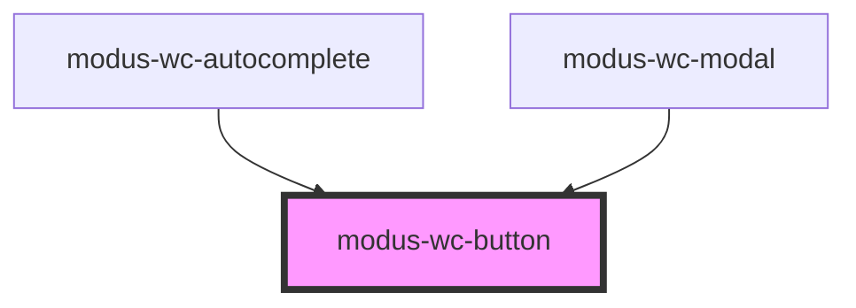

# modus-wc-button

<!-- Auto Generated Below -->

## Overview

A customizable button component used to create buttons with different sizes, variants, and types.

The component supports a `<slot>` for injecting content within the button, similar to a native HTML button.

Adheres to WCAG 2.2 standards.

## Properties

| Property      | Attribute      | Description                                                          | Type                                                              | Default       |
| ------------- | -------------- | -------------------------------------------------------------------- | ----------------------------------------------------------------- | ------------- |
| `color`       | `color`        | The color variant of the button.                                     | `"danger" \| "primary" \| "secondary" \| "tertiary" \| "warning"` | `'primary'`   |
| `customClass` | `custom-class` | Custom CSS class to apply to the button element.                     | `string \| undefined`                                             | `''`          |
| `disabled`    | `disabled`     | If true, the button will be disabled.                                | `boolean \| undefined`                                            | `false`       |
| `fullWidth`   | `full-width`   | If true, the button will take the full width of its container.       | `boolean \| undefined`                                            | `false`       |
| `pressed`     | `pressed`      | If true, the button will be in a pressed state (for toggle buttons). | `boolean \| undefined`                                            | `false`       |
| `shape`       | `shape`        | The shape of the button.                                             | `"circle" \| "rectangle" \| "square"`                             | `'rectangle'` |
| `size`        | `size`         | The size of the button.                                              | `"lg" \| "md" \| "sm" \| "xs"`                                    | `'md'`        |
| `type`        | `type`         | The type of the button.                                              | `"button" \| "reset" \| "submit"`                                 | `'button'`    |
| `variant`     | `variant`      | The variant of the button.                                           | `"borderless" \| "filled" \| "outlined"`                          | `'filled'`    |

## Events

| Event         | Description                                                         | Type                                       |
| ------------- | ------------------------------------------------------------------- | ------------------------------------------ |
| `buttonClick` | Event emitted when the button is clicked or activated via keyboard. | `CustomEvent<KeyboardEvent \| MouseEvent>` |

## Dependencies

### Used by

 - [modus-wc-autocomplete](../../molecules/modus-wc-autocomplete)
 - [modus-wc-modal](../../molecules/modus-wc-modal)

### Graph

----------------------------------------------

*Built with [StencilJS](https://stenciljs.com/)*
