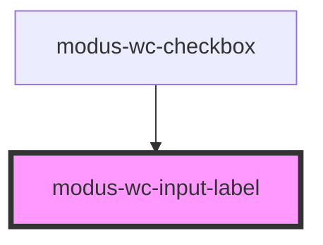

# modus-wc-input-label

<!-- Auto Generated Below -->

## Overview

A customizable input label component.

The component supports a `<slot>` for injecting additional custom content inside the label, such as icons or formatted text.

Adheres to WCAG 2.2 standards.

## Properties

| Property      | Attribute      | Description                                                                  | Type                                          | Default     |
| ------------- | -------------- | ---------------------------------------------------------------------------- | --------------------------------------------- | ----------- |
| `customClass` | `custom-class` | Additional classes for custom styling.                                       | `string \| undefined`                         | `''`        |
| `forId`       | `for-id`       | The `for` attribute of the label, matching the `id` of the associated input. | `string \| undefined`                         | `undefined` |
| `labelDir`    | `label-dir`    | Specifies the text direction of the label content.                           | `"" \| "auto" \| "ltr" \| "rtl" \| undefined` | `undefined` |
| `labelText`   | `label-text`   | The text to display within the label.                                        | `string \| undefined`                         | `undefined` |
| `required`    | `required`     | Whether the label indicates a required field.                                | `boolean \| undefined`                        | `false`     |

## Dependencies

### Used by

 - [modus-wc-checkbox](../../molecules/modus-wc-checkbox)

### Graph

----------------------------------------------

*Built with [StencilJS](https://stenciljs.com/)*
