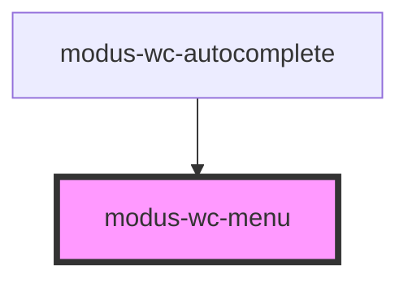

# modus-wc-menu

<!-- Auto Generated Below -->

## Overview

A customizable menu component used to display a list of li elements vertically or horizontally.

The component supports a `<slot>` for injecting custom li elements inside the ul.

Adheres to WCAG 2.2 standards.

## Properties

| Property      | Attribute      | Description                                  | Type                                      | Default      |
| ------------- | -------------- | -------------------------------------------- | ----------------------------------------- | ------------ |
| `customClass` | `custom-class` | Custom CSS class to apply to the ul element. | `string \| undefined`                     | `''`         |
| `orientation` | `orientation`  | The orientation of the menu.                 | `"horizontal" \| "vertical" \| undefined` | `'vertical'` |
| `size`        | `size`         | The size of the menu.                        | `"lg" \| "md" \| "sm" \| undefined`       | `'md'`       |

## Dependencies

### Used by

 - [modus-wc-autocomplete](../../molecules/modus-wc-autocomplete)

### Graph

----------------------------------------------

*Built with [StencilJS](https://stenciljs.com/)*
