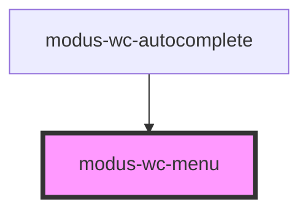

# modus-wc-menu

<!-- Auto Generated Below -->

## Overview

A customizable menu component used to display a list of links vertically or horizontally.

Adheres to WCAG 2.2 standards.

## Properties

| Property                 | Attribute           | Description                                                   | Type                                      | Default      |
| ------------------------ | ------------------- | ------------------------------------------------------------- | ----------------------------------------- | ------------ |
| `activeItemValue`        | `active-item-value` | The active menu item value, used to show an item as selected. | `string \| undefined`                     | `undefined`  |
| `ariaLabel` _(required)_ | `aria-label`        | The aria-label attribute for accessibility.                   | `string`                                  | `undefined`  |
| `bordered`               | `bordered`          | Indicates that the menu should have a border.                 | `boolean \| undefined`                    | `true`       |
| `customClass`            | `custom-class`      | Custom CSS class to apply to the ul element.                  | `string \| undefined`                     | `''`         |
| `items`                  | --                  | The items to display in the menu.                             | `IMenuItem[]`                             | `[]`         |
| `menuTitle`              | `menu-title`        | The menu title, rendered as the first item (disabled).        | `string \| undefined`                     | `undefined`  |
| `orientation`            | `orientation`       | The orientation of the menu.                                  | `"horizontal" \| "vertical" \| undefined` | `'vertical'` |
| `size`                   | `size`              | The size of the menu.                                         | `"lg" \| "md" \| "sm" \| undefined`       | `'md'`       |

## Events

| Event        | Description                                 | Type                     |
| ------------ | ------------------------------------------- | ------------------------ |
| `itemSelect` | Event emitted when a menu item is selected. | `CustomEvent<IMenuItem>` |

## Dependencies

### Used by

 - [modus-wc-autocomplete](../../molecules/modus-wc-autocomplete)

### Graph

----------------------------------------------

*Built with [StencilJS](https://stenciljs.com/)*
