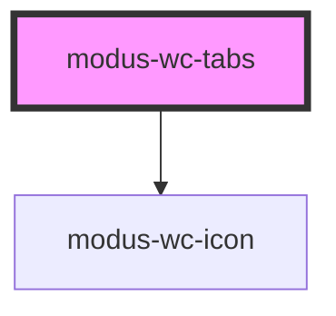

# modus-wc-avatar

<!-- Auto Generated Below -->

## Overview

A customizable tabs component used to create groups of tabs.

Adheres to WCAG 2.2 standards.

## Properties

| Property      | Attribute      | Description                                 | Type                                                       | Default      |
| ------------- | -------------- | ------------------------------------------- | ---------------------------------------------------------- | ------------ |
| `customClass` | `custom-class` | Custom CSS class to apply to the inner div. | `string`                                                   | `''`         |
| `selected`    | `selected`     | Default tab selected by index.              | `number`                                                   | `0`          |
| `size`        | `size`         | The size of the tabs.                       | `"lg" \| "md" \| "sm" \| "xs" \| undefined`                | `'md'`       |
| `tabStyle`    | `tab-style`    | Additional styling for the tabs.            | `"bordered" \| "boxed" \| "lifted" \| "none" \| undefined` | `'bordered'` |
| `tabs`        | --             | The tabs to display.                        | `IModusWcTab[]`                                            | `[]`         |

## Events

| Event       | Description                                         | Type                  |
| ----------- | --------------------------------------------------- | --------------------- |
| `tabChange` | Event emitted when the `selected` property changes. | `CustomEvent<string>` |

## Dependencies

### Depends on

- [modus-wc-icon](../modus-wc-icon)

### Graph

----------------------------------------------

*Built with [StencilJS](https://stenciljs.com/)*
