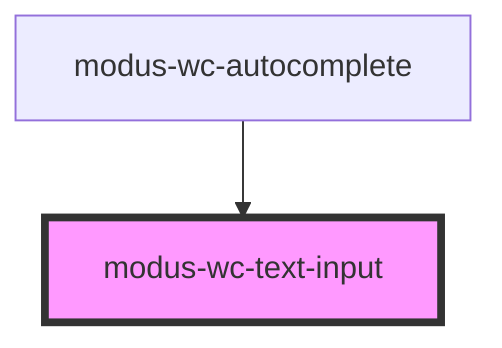

# modus-wc-text-input

<!-- Auto Generated Below -->

## Overview

A customizable input component used to create text inputs with types.

Adheres to WCAG 2.2 standards.

## Properties

| Property          | Attribute          | Description                                                                                                                                                              | Type                                                                                  | Default     |
| ----------------- | ------------------ | ------------------------------------------------------------------------------------------------------------------------------------------------------------------------ | ------------------------------------------------------------------------------------- | ----------- |
| `autoCapitalize`  | `auto-capitalize`  | Controls automatic capitalization in inputted text.                                                                                                                      | `"characters" \| "none" \| "off" \| "on" \| "sentences" \| "words" \| undefined`      | `undefined` |
| `autoComplete`    | `auto-complete`    | Hint for form autofill feature.                                                                                                                                          | `"off" \| "on" \| undefined`                                                          | `undefined` |
| `bordered`        | `bordered`         | Indicates that the input should have a border.                                                                                                                           | `boolean \| undefined`                                                                | `true`      |
| `customClass`     | `custom-class`     | Custom CSS class to apply to the input.                                                                                                                                  | `string \| undefined`                                                                 | `''`        |
| `disabled`        | `disabled`         | Whether the form control is disabled.                                                                                                                                    | `boolean \| undefined`                                                                | `false`     |
| `inputDir`        | `input-dir`        | Specifies the text direction of the input content.                                                                                                                       | `"" \| "auto" \| "ltr" \| "rtl" \| undefined`                                         | `undefined` |
| `inputId`         | `input-id`         | The ID of the input element.                                                                                                                                             | `string \| undefined`                                                                 | `undefined` |
| `inputMode`       | `input-mode`       | Hints at the type of data that might be entered by the user while editing the element or its contents. This allows a browser to display an appropriate virtual keyboard. | `"decimal" \| "email" \| "none" \| "numeric" \| "search" \| "tel" \| "text" \| "url"` | `'text'`    |
| `inputSpellcheck` | `input-spellcheck` | Whether the element may be checked for spelling errors. A hint for the browser, not a guarantee.                                                                         | `boolean \| undefined`                                                                | `false`     |
| `inputTabIndex`   | `input-tab-index`  | Determine the control's relative ordering for sequential focus navigation (typically with the Tab key).                                                                  | `number \| undefined`                                                                 | `undefined` |
| `maxLength`       | `max-length`       | Maximum length (number of characters) of value.                                                                                                                          | `number \| undefined`                                                                 | `undefined` |
| `minLength`       | `min-length`       | Minimum length (number of characters) of value.                                                                                                                          | `number \| undefined`                                                                 | `undefined` |
| `name`            | `name`             | Name of the form control. Submitted with the form as part of a name/value pair.                                                                                          | `string \| undefined`                                                                 | `undefined` |
| `pattern`         | `pattern`          | Pattern the value must match to be valid                                                                                                                                 | `string \| undefined`                                                                 | `undefined` |
| `placeholder`     | `placeholder`      | Text that appears in the form control when it has no value set.                                                                                                          | `string \| undefined`                                                                 | `''`        |
| `readOnly`        | `read-only`        | Whether the value is editable.                                                                                                                                           | `boolean \| undefined`                                                                | `false`     |
| `required`        | `required`         | A value is required for the form to be submittable.                                                                                                                      | `boolean \| undefined`                                                                | `false`     |
| `size`            | `size`             | The size of the input.                                                                                                                                                   | `"lg" \| "md" \| "sm" \| undefined`                                                   | `'md'`      |
| `type`            | `type`             | Type of form control.                                                                                                                                                    | `"email" \| "password" \| "search" \| "tel" \| "text" \| "url" \| undefined`          | `'text'`    |
| `value`           | `value`            | The value of the control.                                                                                                                                                | `string`                                                                              | `''`        |

## Events

| Event         | Description                                 | Type                      |
| ------------- | ------------------------------------------- | ------------------------- |
| `inputBlur`   | Event emitted when the input loses focus.   | `CustomEvent<FocusEvent>` |
| `inputChange` | Event emitted when the input value changes. | `CustomEvent<InputEvent>` |
| `inputFocus`  | Event emitted when the input gains focus.   | `CustomEvent<FocusEvent>` |

## Dependencies

### Used by

 - [modus-wc-autocomplete](../../molecules/modus-wc-autocomplete)

### Graph

----------------------------------------------

*Built with [StencilJS](https://stenciljs.com/)*
