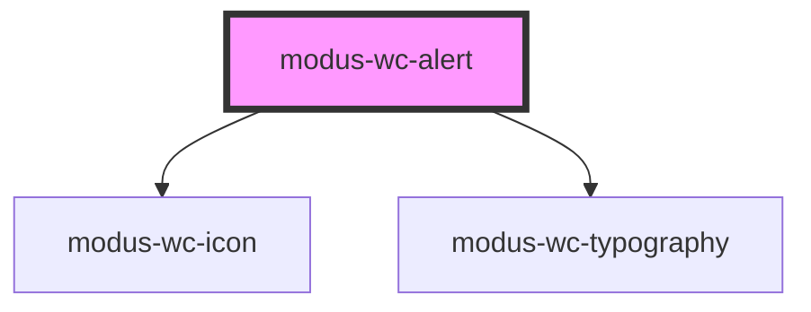

# modus-wc-alert

<!-- Auto Generated Below -->

## Overview

A customizable alert component used to inform the user about important events.

Adheres to WCAG 2.2 standards.

## Properties

| Property                  | Attribute           | Description                                         | Type                                                       | Default     |
| ------------------------- | ------------------- | --------------------------------------------------- | ---------------------------------------------------------- | ----------- |
| `alertDescription`        | `alert-description` | The description of the alert. *                     | `string \| undefined`                                      | `undefined` |
| `alertTitle` _(required)_ | `alert-title`       | The title of the alert. *                           | `string`                                                   | `undefined` |
| `customClass`             | `custom-class`      | Custom CSS class to apply to the outer div element. | `string \| undefined`                                      | `''`        |
| `icon`                    | `icon`              | The Modus icon to render. *                         | `string \| undefined`                                      | `undefined` |
| `variant`                 | `variant`           | The variant of the alert.                           | `"error" \| "info" \| "success" \| "warning" \| undefined` | `undefined` |

## Dependencies

### Depends on

- [modus-wc-icon](../modus-wc-icon)
- [modus-wc-typography](../modus-wc-typography)

### Graph

----------------------------------------------

*Built with [StencilJS](https://stenciljs.com/)*
