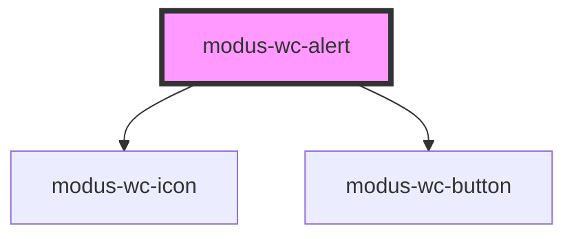

# modus-wc-alert

<!-- Auto Generated Below -->

## Overview

A customizable alert component used to inform the user about important events

## Properties

| Property                  | Attribute           | Description                                         | Type                                                       | Default     |
| ------------------------- | ------------------- | --------------------------------------------------- | ---------------------------------------------------------- | ----------- |
| `alertDescription`        | `alert-description` | The description of the alert.                       | `string \| undefined`                                      | `undefined` |
| `alertTitle` _(required)_ | `alert-title`       | The title of the alert.                             | `string`                                                   | `undefined` |
| `customClass`             | `custom-class`      | Custom CSS class to apply to the outer div element. | `string \| undefined`                                      | `''`        |
| `delay`                   | `delay`             | Time taken to dismiss the alert in milliseconds     | `number \| undefined`                                      | `undefined` |
| `dismissible`             | `dismissible`       | Whether the alert has a dismiss button              | `boolean \| undefined`                                     | `false`     |
| `icon`                    | `icon`              | The Modus icon to render.                           | `string \| undefined`                                      | `undefined` |
| `variant`                 | `variant`           | The variant of the alert.                           | `"error" \| "info" \| "success" \| "warning" \| undefined` | `'info'`    |

## Events

| Event          | Description                                     | Type               |
| -------------- | ----------------------------------------------- | ------------------ |
| `dismissClick` | An event that fires when the alert is dismissed | `CustomEvent<any>` |

## Dependencies

### Depends on

- [modus-wc-icon](../modus-wc-icon)
- [modus-wc-button](../modus-wc-button)

### Graph

----------------------------------------------

*Built with [StencilJS](https://stenciljs.com/)*
