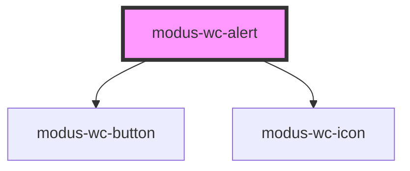

# modus-wc-alert

<!-- Auto Generated Below -->

## Overview

A customizable alert component used to inform the user about important events.

The component supports `<slot>` elements for injecting custom content and buttons.

## Properties

| Property                  | Attribute              | Description                                                                               | Type                                                                    | Default     |
| ------------------------- | ---------------------- | ----------------------------------------------------------------------------------------- | ----------------------------------------------------------------------- | ----------- |
| `alertDescription`        | `alert-description`    | The description of the alert.                                                             | `string \| undefined`                                                   | `undefined` |
| `alertTitle` _(required)_ | `alert-title`          | The title of the alert.                                                                   | `string`                                                                | `undefined` |
| `contentDisplayMode`      | `content-display-mode` | Controls body display: full text (default) or expandable two-line preview with Show more. | `"default" \| "expandable" \| undefined`                                | `'default'` |
| `customClass`             | `custom-class`         | Custom CSS class to apply to the outer div element.                                       | `string \| undefined`                                                   | `''`        |
| `delay`                   | `delay`                | Time taken to dismiss the alert in milliseconds                                           | `number \| undefined`                                                   | `undefined` |
| `disableIcon`             | `disable-icon`         | Whether to disable the icon                                                               | `boolean \| undefined`                                                  | `false`     |
| `dismissible`             | `dismissible`          | Whether the alert has a dismiss button                                                    | `boolean \| undefined`                                                  | `false`     |
| `icon`                    | `icon`                 | The Modus icon to render.                                                                 | `string \| undefined`                                                   | `undefined` |
| `variant`                 | `variant`              | The variant of the alert.                                                                 | `"error" \| "info" \| "neutral" \| "success" \| "warning" \| undefined` | `'info'`    |

## Events

| Event                   | Description                                                  | Type                                  |
| ----------------------- | ------------------------------------------------------------ | ------------------------------------- |
| `contentExpandedChange` | Fires when expandable body content is expanded or collapsed. | `CustomEvent<{ expanded: boolean; }>` |
| `dismissClick`          | An event that fires when the alert is dismissed              | `CustomEvent<any>`                    |

## Dependencies

### Depends on

- [modus-wc-button](../modus-wc-button)
- [modus-wc-icon](../modus-wc-icon)

### Graph

```mermaid
graph TD;
  modus-wc-alert --> modus-wc-button
  modus-wc-alert --> modus-wc-icon
  style modus-wc-alert fill:#f9f,stroke:#333,stroke-width:4px
```

----------------------------------------------

*Built with [StencilJS](https://stenciljs.com/)*
