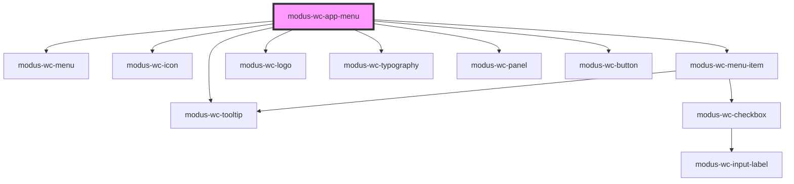

# modus-wc-app-menu

<!-- Auto Generated Below -->

## Properties

| Property      | Attribute      | Description                       | Type                            | Default  |
| ------------- | -------------- | --------------------------------- | ------------------------------- | -------- |
| `apps`        | `apps`         | The apps to display in the menu.  | `IAppMenuItem[] \| undefined`   | `[]`     |
| `customClass` | `custom-class` | custom class to apply to the menu | `string \| undefined`           | `''`     |
| `layout`      | `layout`       | The layout of the menu.           | `"grid" \| "list" \| undefined` | `'list'` |

## Events

| Event              | Description                                                                                  | Type                                         |
| ------------------ | -------------------------------------------------------------------------------------------- | -------------------------------------------- |
| `itemClick`        | Emitted when an item is clicked                                                              | `CustomEvent<{ appName: LogoName; }>`        |
| `itemsOrderChange` | Emitted when reordering is confirmed via "Done" and the order differs from when edit started | `CustomEvent<IAppMenuItem[]>`                |
| `layoutChange`     | Emit event when the layout changes                                                           | `CustomEvent<{ layout: "list" \| "grid"; }>` |

## Dependencies

### Depends on

- [modus-wc-menu](../modus-wc-menu)
- [modus-wc-icon](../modus-wc-icon)
- [modus-wc-menu-item](../modus-wc-menu-item)
- [modus-wc-logo](../modus-wc-logo)
- [modus-wc-tooltip](../modus-wc-tooltip)
- [modus-wc-typography](../modus-wc-typography)
- [modus-wc-panel](../modus-wc-panel)
- [modus-wc-button](../modus-wc-button)

### Graph

----------------------------------------------

*Built with [StencilJS](https://stenciljs.com/)*
