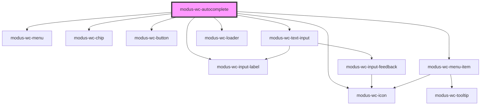

# modus-wc-autocomplete

<!-- Auto Generated Below -->

## Overview

A customizable autocomplete component used to create searchable text inputs.

## Properties

| Property            | Attribute             | Description                                                                                                          | Type                                               | Default                                                                                                                              |
| ------------------- | --------------------- | -------------------------------------------------------------------------------------------------------------------- | -------------------------------------------------- | ------------------------------------------------------------------------------------------------------------------------------------ |
| `bordered`          | `bordered`            | Indicates that the autocomplete should have a border.                                                                | `boolean \| undefined`                             | `true`                                                                                                                               |
| `customBlur`        | `custom-blur`         | Custom blur handler - if provided, overrides default blur behavior                                                   | `((event: FocusEvent) => void) \| undefined`       | `undefined`                                                                                                                          |
| `customClass`       | `custom-class`        | Custom CSS class to apply to host element.                                                                           | `string \| undefined`                              | `''`                                                                                                                                 |
| `customInputChange` | `custom-input-change` | Custom input change handler - if provided, overrides default search filtering                                        | `((value: string) => void) \| undefined`           | `undefined`                                                                                                                          |
| `customItemSelect`  | `custom-item-select`  | Custom item selection handler - if provided, overrides default selection logic                                       | `((item: IAutocompleteItem) => void) \| undefined` | `undefined`                                                                                                                          |
| `customKeyDown`     | `custom-key-down`     | Custom key down handler - if provided, overrides default keyboard navigation                                         | `((event: KeyboardEvent) => void) \| undefined`    | `undefined`                                                                                                                          |
| `debounceMs`        | `debounce-ms`         | The debounce timeout in milliseconds. Set to 0 to disable debouncing.                                                | `number \| undefined`                              | `300`                                                                                                                                |
| `disabled`          | `disabled`            | Whether the form control is disabled.                                                                                | `boolean \| undefined`                             | `false`                                                                                                                              |
| `includeClear`      | `include-clear`       | Show the clear button within the input field.                                                                        | `boolean \| undefined`                             | `false`                                                                                                                              |
| `includeSearch`     | `include-search`      | Show the search icon within the input field.                                                                         | `boolean \| undefined`                             | `false`                                                                                                                              |
| `inputId`           | `input-id`            | The ID of the input element.                                                                                         | `string \| undefined`                              | `undefined`                                                                                                                          |
| `inputTabIndex`     | `input-tab-index`     | Determine the control's relative ordering for sequential focus navigation (typically with the Tab key).              | `number \| undefined`                              | `undefined`                                                                                                                          |
| `items`             | `items`               | The items to display in the menu. Creating a new array of items will ensure proper component re-render.              | `IAutocompleteItem[] \| undefined`                 | `[]`                                                                                                                                 |
| `label`             | `label`               | The text to display within the label.                                                                                | `string \| undefined`                              | `undefined`                                                                                                                          |
| `leaveMenuOpen`     | `leave-menu-open`     | Whether the menu should remain open after an item is selected.                                                       | `boolean \| undefined`                             | `false`                                                                                                                              |
| `maxChips`          | `max-chips`           | Maximum number of chips to display. When exceeded, shows expand/collapse button. Set to -1 to disable limit.         | `number \| undefined`                              | `-1`                                                                                                                                 |
| `minChars`          | `min-chars`           | The minimum number of characters required to render the menu.                                                        | `number`                                           | `0`                                                                                                                                  |
| `minInputWidth`     | `min-input-width`     | Minimum width for the text input in pixels. When chips would make input smaller, container height increases instead. | `number \| undefined`                              | `10`                                                                                                                                 |
| `multiSelect`       | `multi-select`        | Whether the input allows multiple items to be selected.                                                              | `boolean \| undefined`                             | `false`                                                                                                                              |
| `name`              | `name`                | Name of the form control. Submitted with the form as part of a name/value pair.                                      | `string \| undefined`                              | `undefined`                                                                                                                          |
| `noResults`         | `no-results`          | The content to display when no results are found.                                                                    | `IAutocompleteNoResults \| undefined`              | `{     ariaLabel: 'No results found',     label: 'No results found',     subLabel: 'Check spelling or try a different keyword',   }` |
| `placeholder`       | `placeholder`         | Text that appears in the form control when it has no value set.                                                      | `string \| undefined`                              | `''`                                                                                                                                 |
| `readOnly`          | `read-only`           | Whether the value is editable.                                                                                       | `boolean \| undefined`                             | `false`                                                                                                                              |
| `required`          | `required`            | A value is required for the form to be submittable.                                                                  | `boolean \| undefined`                             | `false`                                                                                                                              |
| `showMenuOnFocus`   | `show-menu-on-focus`  | Whether to show the menu whenever the input has focus, regardless of input value.                                    | `boolean \| undefined`                             | `false`                                                                                                                              |
| `showSpinner`       | `show-spinner`        | A spinner that appears when set to true                                                                              | `boolean \| undefined`                             | `false`                                                                                                                              |
| `size`              | `size`                | The size of the autocomplete (input and menu).                                                                       | `"lg" \| "md" \| "sm" \| undefined`                | `'md'`                                                                                                                               |
| `value`             | `value`               | The value of the control.                                                                                            | `string`                                           | `''`                                                                                                                                 |

## Events

| Event                  | Description                                                                                       | Type                                  |
| ---------------------- | ------------------------------------------------------------------------------------------------- | ------------------------------------- |
| `chipRemove`           | Event emitted when a selected item chip is removed.                                               | `CustomEvent<IAutocompleteItem>`      |
| `chipsExpansionChange` | Event emitted when chips expansion state changes.                                                 | `CustomEvent<{ expanded: boolean; }>` |
| `inputBlur`            | Event emitted when the input loses focus.                                                         | `CustomEvent<FocusEvent>`             |
| `inputChange`          | Event emitted when the input value changes. This event is debounced based on the debounceMs prop. | `CustomEvent<Event>`                  |
| `inputFocus`           | Event emitted when the input gains focus.                                                         | `CustomEvent<FocusEvent>`             |
| `itemSelect`           | Event emitted when a menu item is selected.                                                       | `CustomEvent<IAutocompleteItem>`      |

## Methods

### `clearInput() => Promise<void>`

Clear the input value and reset items

#### Returns

Type: `Promise<void>`

### `closeMenu() => Promise<void>`

Programmatically close the menu

#### Returns

Type: `Promise<void>`

### `focusInput() => Promise<void>`

Programmatically set focus to input

#### Returns

Type: `Promise<void>`

### `openMenu() => Promise<void>`

Programmatically open the menu

#### Returns

Type: `Promise<void>`

### `selectItem(item: IAutocompleteItem | null) => Promise<void>`

Programmatically select an item

#### Parameters

| Name   | Type                        | Description |
| ------ | --------------------------- | ----------- |
| `item` | `IAutocompleteItem \| null` |             |

#### Returns

Type: `Promise<void>`

### `toggleMenu() => Promise<void>`

Programmatically toggle the menu open/closed

#### Returns

Type: `Promise<void>`

## Dependencies

### Depends on

- [modus-wc-input-label](../modus-wc-input-label)
- [modus-wc-menu](../modus-wc-menu)
- [modus-wc-chip](../modus-wc-chip)
- [modus-wc-button](../modus-wc-button)
- [modus-wc-icon](../modus-wc-icon)
- [modus-wc-text-input](../modus-wc-text-input)
- [modus-wc-loader](../modus-wc-loader)
- [modus-wc-menu-item](../modus-wc-menu-item)

### Graph

----------------------------------------------

*Built with [StencilJS](https://stenciljs.com/)*
