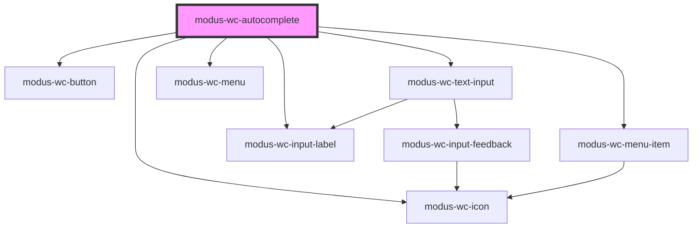

# modus-wc-autocomplete

<!-- Auto Generated Below -->

## Overview

A customizable autocomplete component used to create searchable text inputs.

Adheres to WCAG 2.2 standards.

## Properties

| Property        | Attribute         | Description                                                                                             | Type                                  | Default     |
| --------------- | ----------------- | ------------------------------------------------------------------------------------------------------- | ------------------------------------- | ----------- |
| `bordered`      | `bordered`        | Indicates that the autocomplete should have a border.                                                   | `boolean \| undefined`                | `true`      |
| `customClass`   | `custom-class`    | Custom CSS class to apply to host element.                                                              | `string \| undefined`                 | `''`        |
| `debounceMs`    | `debounce-ms`     | The debounce timeout in milliseconds. Set to 0 to disable debouncing.                                   | `number \| undefined`                 | `300`       |
| `disabled`      | `disabled`        | Whether the form control is disabled.                                                                   | `boolean \| undefined`                | `false`     |
| `inputId`       | `input-id`        | The ID of the input element.                                                                            | `string \| undefined`                 | `undefined` |
| `inputTabIndex` | `input-tab-index` | Determine the control's relative ordering for sequential focus navigation (typically with the Tab key). | `number \| undefined`                 | `undefined` |
| `items`         | --                | The items to display in the menu. Creating a new array of items will ensure proper component re-render. | `IAutocompleteItem[]`                 | `[]`        |
| `label`         | `label`           | The text to display within the label.                                                                   | `string \| undefined`                 | `undefined` |
| `minChars`      | `min-chars`       | The minimum number of characters required to render the menu.                                           | `number`                              | `0`         |
| `multiSelect`   | `multi-select`    | Whether the input allows multiple items to be selected.                                                 | `boolean \| undefined`                | `false`     |
| `name`          | `name`            | Name of the form control. Submitted with the form as part of a name/value pair.                         | `string \| undefined`                 | `undefined` |
| `noResults`     | --                | The content to display when no results are found.                                                       | `IAutocompleteNoResults \| undefined` | `undefined` |
| `placeholder`   | `placeholder`     | Text that appears in the form control when it has no value set.                                         | `string \| undefined`                 | `''`        |
| `readOnly`      | `read-only`       | Whether the value is editable.                                                                          | `boolean \| undefined`                | `false`     |
| `required`      | `required`        | A value is required for the form to be submittable.                                                     | `boolean \| undefined`                | `false`     |
| `size`          | `size`            | The size of the autocomplete (input and menu).                                                          | `"lg" \| "md" \| "sm" \| undefined`   | `'md'`      |
| `value`         | `value`           | The value of the control.                                                                               | `string`                              | `''`        |

## Events

| Event         | Description                                                                                       | Type                             |
| ------------- | ------------------------------------------------------------------------------------------------- | -------------------------------- |
| `chipRemove`  | Event emitted when a selected item chip is removed.                                               | `CustomEvent<IAutocompleteItem>` |
| `inputBlur`   | Event emitted when the input loses focus.                                                         | `CustomEvent<FocusEvent>`        |
| `inputChange` | Event emitted when the input value changes. This event is debounced based on the debounceMs prop. | `CustomEvent<Event>`             |
| `inputFocus`  | Event emitted when the input gains focus.                                                         | `CustomEvent<FocusEvent>`        |
| `itemSelect`  | Event emitted when a menu item is selected.                                                       | `CustomEvent<IAutocompleteItem>` |

## Dependencies

### Depends on

- [modus-wc-icon](../modus-wc-icon)
- [modus-wc-button](../modus-wc-button)
- [modus-wc-text-input](../modus-wc-text-input)
- [modus-wc-menu-item](../modus-wc-menu-item)
- [modus-wc-input-label](../modus-wc-input-label)
- [modus-wc-menu](../modus-wc-menu)

### Graph

----------------------------------------------

*Built with [StencilJS](https://stenciljs.com/)*
