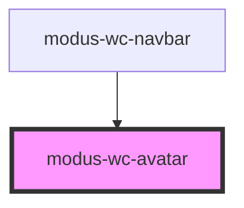

# modus-wc-avatar

<!-- Auto Generated Below -->

## Overview

A customizable avatar component used to create avatars with different images.

## Properties

| Property           | Attribute      | Description                                        | Type                                        | Default     |
| ------------------ | -------------- | -------------------------------------------------- | ------------------------------------------- | ----------- |
| `alt` _(required)_ | `alt`          | The image alt attribute for accessibility.         | `string`                                    | `undefined` |
| `customClass`      | `custom-class` | Custom CSS class to apply to the inner div.        | `string \| undefined`                       | `''`        |
| `imgSrc`           | `img-src`      | The location of the image.                         | `string`                                    | `''`        |
| `initials`         | `initials`     | The initials to display when no image is provided. | `string \| undefined`                       | `''`        |
| `shape`            | `shape`        | The shape of the avatar.                           | `"circle" \| "square" \| undefined`         | `'circle'`  |
| `size`             | `size`         | The size of the avatar.                            | `"lg" \| "md" \| "sm" \| "xs" \| undefined` | `'md'`      |

## Dependencies

### Used by

 - [modus-wc-navbar](../modus-wc-navbar)

### Graph

----------------------------------------------

*Built with [StencilJS](https://stenciljs.com/)*
