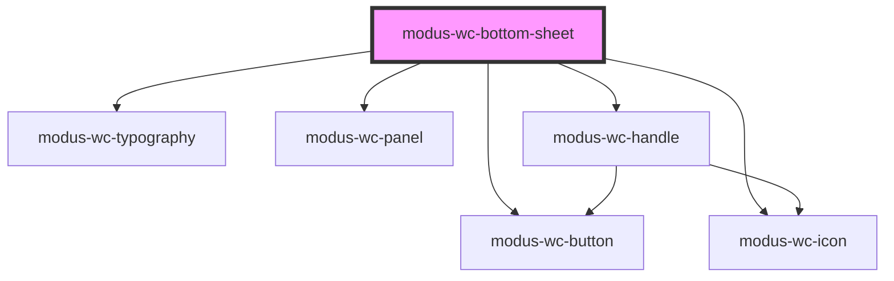

# modus-wc-bottom-sheet

<!-- Auto Generated Below -->

## Properties

| Property            | Attribute             | Description                                                                                                         | Type                                                  | Default     |
| ------------------- | --------------------- | ------------------------------------------------------------------------------------------------------------------- | ----------------------------------------------------- | ----------- |
| `customClass`       | `custom-class`        | Custom CSS class to apply to the outer div.                                                                         | `string \| undefined`                                 | `''`        |
| `displayMode`       | `display-mode`        | Resting display mode: 'minimized', 'default', or 'expanded'. Drag/keyboard interactions do not overwrite this prop. | `"default" \| "expanded" \| "minimized" \| undefined` | `'default'` |
| `dragStepThreshold` | `drag-step-threshold` | Fraction (0-1) of the sheet height it must be dragged, in either direction, before it steps one level.              | `number \| undefined`                                 | `0.4`       |
| `header`            | `header`              | Configuration for the built-in header layout. Do not set this prop if you intend to use the 'header' slot.          | `IBottomSheetHeader \| undefined`                     | `undefined` |
| `visible`           | `visible`             | Controls whether the bottom sheet is visible.                                                                       | `boolean \| undefined`                                | `false`     |

## Events

| Event                   | Description                                                                                                                                                            | Type                                                     |
| ----------------------- | ---------------------------------------------------------------------------------------------------------------------------------------------------------------------- | -------------------------------------------------------- |
| `displayModeChange`     | Event emitted when the display mode changes, whether from a drag/keyboard interaction or from setting the `displayMode` prop. The new mode is in `detail.displayMode`. | `CustomEvent<{ displayMode: TBottomSheetDisplayMode; }>` |
| `headerBackClick`       | Event emitted when the header back button is clicked. Does not change sheet state.                                                                                     | `CustomEvent<void>`                                      |
| `headerCloseClick`      | Event emitted when the header dismiss button is clicked. The sheet is also closed automatically (`visible` is set to `false`).                                         | `CustomEvent<void>`                                      |
| `sheetVisibilityChange` | Event emitted when the visibility of the bottom sheet changes.                                                                                                         | `CustomEvent<{ visible: boolean; }>`                     |

## Dependencies

### Depends on

- [modus-wc-button](../modus-wc-button)
- [modus-wc-icon](../modus-wc-icon)
- [modus-wc-typography](../modus-wc-typography)
- [modus-wc-panel](../modus-wc-panel)
- [modus-wc-handle](../modus-wc-handle)

### Graph

----------------------------------------------

*Built with [StencilJS](https://stenciljs.com/)*
