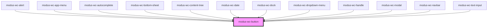

# modus-wc-button

<!-- Auto Generated Below -->

## Overview

A customizable button component used to create buttons with different sizes, variants, and types.

The component supports a `<slot>` for injecting content within the button, similar to a native HTML button.

## Properties

| Property          | Attribute      | Description                                                          | Type                                                                                        | Default       |
| ----------------- | -------------- | -------------------------------------------------------------------- | ------------------------------------------------------------------------------------------- | ------------- |
| `buttonAriaLabel` | `aria-label`   | Maps to the inner button's aria-label attribute.                     | `string \| undefined`                                                                       | `undefined`   |
| `color`           | `color`        | The color variant of the button.                                     | `"danger" \| "neutral" \| "primary" \| "secondary" \| "success" \| "tertiary" \| "warning"` | `'primary'`   |
| `currentAria`     | `aria-current` | Maps to the inner button's aria-current attribute.                   | `string \| undefined`                                                                       | `undefined`   |
| `customClass`     | `custom-class` | Custom CSS class to apply to the button element.                     | `string \| undefined`                                                                       | `''`          |
| `disabled`        | `disabled`     | If true, the button will be disabled.                                | `boolean \| undefined`                                                                      | `false`       |
| `fullWidth`       | `full-width`   | If true, the button will take the full width of its container.       | `boolean \| undefined`                                                                      | `false`       |
| `pressed`         | `pressed`      | If true, the button will be in a pressed state (for toggle buttons). | `boolean \| undefined`                                                                      | `false`       |
| `shape`           | `shape`        | The shape of the button.                                             | `"circle" \| "ellipse" \| "rectangle" \| "square"`                                          | `'rectangle'` |
| `size`            | `size`         | The size of the button.                                              | `"lg" \| "md" \| "sm" \| "xl" \| "xs"`                                                      | `'md'`        |
| `type`            | `type`         | The type of the button.                                              | `"button" \| "reset" \| "submit"`                                                           | `'button'`    |
| `variant`         | `variant`      | The variant of the button.                                           | `"borderless" \| "filled" \| "outlined"`                                                    | `'filled'`    |

## Events

| Event         | Description                                                         | Type                                       |
| ------------- | ------------------------------------------------------------------- | ------------------------------------------ |
| `buttonClick` | Event emitted when the button is clicked or activated via keyboard. | `CustomEvent<KeyboardEvent \| MouseEvent>` |

## Dependencies

### Used by

 - [modus-wc-alert](../modus-wc-alert)
 - [modus-wc-app-menu](../modus-wc-app-menu)
 - [modus-wc-autocomplete](../modus-wc-autocomplete)
 - [modus-wc-bottom-sheet](../modus-wc-bottom-sheet)
 - [modus-wc-content-tree](../modus-wc-content-tree)
 - [modus-wc-date](../modus-wc-date)
 - [modus-wc-dock](../modus-wc-dock)
 - [modus-wc-dropdown-menu](../modus-wc-dropdown-menu)
 - [modus-wc-handle](../modus-wc-handle)
 - [modus-wc-modal](../modus-wc-modal)
 - [modus-wc-navbar](../modus-wc-navbar)
 - [modus-wc-text-input](../modus-wc-text-input)

### Graph

----------------------------------------------

*Built with [StencilJS](https://stenciljs.com/)*
