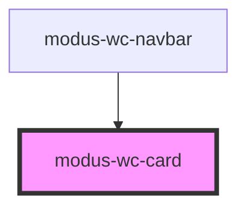

# modus-wc-card

<!-- Auto Generated Below -->

## Overview

A customizable card component used to group and display content in a way that is easily readable.

Adheres to WCAG 2.2 standards.

## Properties

| Property           | Attribute           | Description                                                   | Type                                      | Default      |
| ------------------ | ------------------- | ------------------------------------------------------------- | ----------------------------------------- | ------------ |
| `backgroundFigure` | `background-figure` | Makes any \<figure> in the 'header' slot cover the background | `boolean \| undefined`                    | `false`      |
| `bordered`         | `bordered`          | Adds a hard border to the card                                | `boolean \| undefined`                    | `false`      |
| `customClass`      | `custom-class`      | Custom CSS class to apply                                     | `string \| undefined`                     | `''`         |
| `layout`           | `layout`            | Determines how the card is laid out                           | `"horizontal" \| "vertical" \| undefined` | `'vertical'` |
| `padding`          | `padding`           | Determines if the interior padding is compact or not          | `"compact" \| "normal" \| undefined`      | `'normal'`   |

## Dependencies

### Used by

 - [modus-wc-navbar](../modus-wc-navbar)

### Graph

----------------------------------------------

*Built with [StencilJS](https://stenciljs.com/)*
