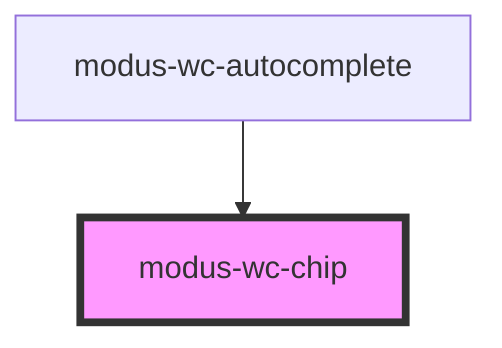

# modus-wc-chip

<!-- Auto Generated Below -->

## Overview

A customizable chip component used to display information in a compact area

The component supports a `<slot>` for injecting custom content such as avatar and icons.

## Properties

| Property      | Attribute      | Description                                               | Type                                   | Default       |
| ------------- | -------------- | --------------------------------------------------------- | -------------------------------------- | ------------- |
| `active`      | `active`       | Active state of chip.                                     | `boolean \| undefined`                 | `false`       |
| `customClass` | `custom-class` | Custom CSS class to apply to the inner div.               | `string \| undefined`                  | `''`          |
| `disabled`    | `disabled`     | Whether the chip is disabled.                             | `boolean \| undefined`                 | `false`       |
| `hasError`    | `has-error`    | Whether the chip has an error.                            | `boolean \| undefined`                 | `false`       |
| `label`       | `label`        | The label to display in the chip.                         | `string \| undefined`                  | `''`          |
| `shape`       | `shape`        | The shape of the chip: 'rectangle' (default) or 'circle'. | `"circle" \| "rectangle" \| undefined` | `'rectangle'` |
| `showRemove`  | `show-remove`  | Whether to show the close icon on right side of the chip. | `boolean \| undefined`                 | `false`       |
| `size`        | `size`         | The size of the chip.                                     | `"lg" \| "md" \| "sm" \| undefined`    | `'md'`        |
| `variant`     | `variant`      | The variant of the chip.                                  | `"filled" \| "outline" \| undefined`   | `'filled'`    |

## Events

| Event        | Description                                                       | Type                                       |
| ------------ | ----------------------------------------------------------------- | ------------------------------------------ |
| `chipClick`  | Event emitted when the chip is clicked or activated via keyboard. | `CustomEvent<KeyboardEvent \| MouseEvent>` |
| `chipRemove` | Event emitted when the close chip icon button is clicked.         | `CustomEvent<KeyboardEvent \| MouseEvent>` |

## Dependencies

### Used by

 - [modus-wc-autocomplete](../modus-wc-autocomplete)

### Graph

----------------------------------------------

*Built with [StencilJS](https://stenciljs.com/)*
