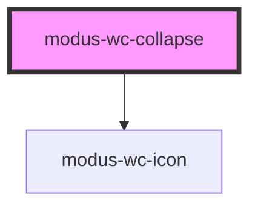

# modus-wc-collapse

<!-- Auto Generated Below -->

## Overview

A customizable collapse component used for showing and hiding content.

The component supports a 'header' and 'content' `<slot>` for injecting custom HTML.

## Properties

| Property          | Attribute          | Description                                                                                                                           | Type                            | Default     |
| ----------------- | ------------------ | ------------------------------------------------------------------------------------------------------------------------------------- | ------------------------------- | ----------- |
| `chevronPosition` | `chevron-position` | Controls chevron placement.                                                                                                           | `"left" \| "right"`             | `'right'`   |
| `collapseId`      | `collapse-id`      | A unique identifier used to set the id attributes of various elements.                                                                | `string \| undefined`           | `undefined` |
| `customClass`     | `custom-class`     | Custom CSS class to apply to the outer div.                                                                                           | `string \| undefined`           | `''`        |
| `expanded`        | `expanded`         | Controls whether the collapse is expanded or not.                                                                                     | `boolean \| undefined`          | `false`     |
| `options`         | `options`          | Configuration options for rendering the pre-laid out collapse component. Do not set this prop if you intend to use the 'header' slot. | `ICollapseOptions \| undefined` | `undefined` |
| `variant`         | `variant`          | Visual style of the collapse component.                                                                                               | `"border" \| "ghost"`           | `'border'`  |

## Events

| Event            | Description                                                 | Type                                  |
| ---------------- | ----------------------------------------------------------- | ------------------------------------- |
| `expandedChange` | Event emitted when the expanded prop is internally changed. | `CustomEvent<{ expanded: boolean; }>` |

## Dependencies

### Depends on

- [modus-wc-icon](../modus-wc-icon)

### Graph

----------------------------------------------

*Built with [StencilJS](https://stenciljs.com/)*
