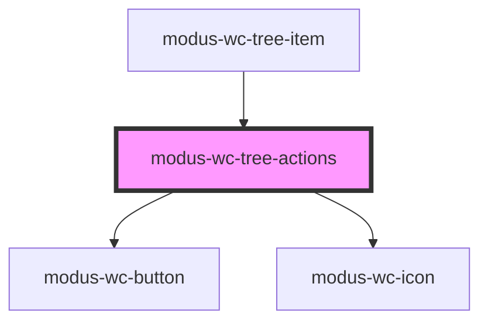

# modus-wc-tree-actions

<!-- Auto Generated Below -->

## Overview

ModusWcTreeActions is a component that renders action buttons for tree items in the Modus content tree.
It supports displaying a primary action and grouping additional actions in a dropdown menu if there are more than two actions.

## Properties

| Property  | Attribute | Description                               | Type                              | Default     |
| --------- | --------- | ----------------------------------------- | --------------------------------- | ----------- |
| `actions` | `actions` | List of actions to display                | `ITreeItemActions[] \| undefined` | `undefined` |
| `size`    | `size`    | The size of the action buttons and icons. | `"lg" \| "md" \| "sm" \| "xs"`    | `'xs'`      |

## Events

| Event             | Description                             | Type                                                     |
| ----------------- | --------------------------------------- | -------------------------------------------------------- |
| `dropdownOpened`  | Event emitted when a dropdown is opened | `CustomEvent<HTMLElement>`                               |
| `treeActionClick` | Event emitted when an action is clicked | `CustomEvent<{ actionId: string; actionName: string; }>` |

## Dependencies

### Used by

 - [modus-wc-tree-item](../modus-wc-tree-item)

### Depends on

- [modus-wc-button](../../modus-wc-button)
- [modus-wc-icon](../../modus-wc-icon)

### Graph

----------------------------------------------

*Built with [StencilJS](https://stenciljs.com/)*
