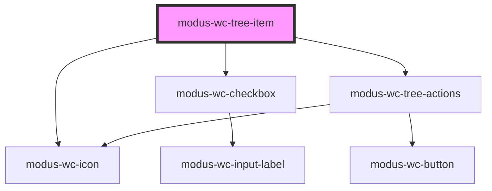

# modus-wc-content-tree-item

<!-- Auto Generated Below -->

## Overview

A tree item component that represents a single node in a hierarchical tree structure.

## Properties

| Property             | Attribute           | Description                                                                                                         | Type                                  | Default     |
| -------------------- | ------------------- | ------------------------------------------------------------------------------------------------------------------- | ------------------------------------- | ----------- |
| `checkbox`           | `checkbox`          | If true, renders a checkbox at the start of the tree item.                                                          | `boolean \| undefined`                | `false`     |
| `customClass`        | `custom-class`      | Custom CSS class to apply to the li element.                                                                        | `string \| undefined`                 | `''`        |
| `disabled`           | `disabled`          | The disabled state of the tree item.                                                                                | `boolean \| undefined`                | `undefined` |
| `hasSubtree`         | `has-subtree`       | Whether this tree item has a collapsible subtree. When true, the item will show a caret and handle toggle behavior. | `boolean \| undefined`                | `undefined` |
| `label` _(required)_ | `label`             | The text label displayed for the tree item.                                                                         | `string`                              | `undefined` |
| `selected`           | `selected`          | The selected state of the tree item.                                                                                | `boolean \| undefined`                | `undefined` |
| `size`               | `size`              | The size of the tree item icons and actions.                                                                        | `"lg" \| "md" \| "sm"`                | `'md'`      |
| `treeItemActions`    | `tree-item-actions` | Actions to display for this tree item.                                                                              | `ModusTreeItemActions[] \| undefined` | `undefined` |
| `value`              | `value`             | The unique identifying value of the tree item.                                                                      | `string`                              | `''`        |

## Events

| Event        | Description                                 | Type                              |
| ------------ | ------------------------------------------- | --------------------------------- |
| `itemSelect` | Event emitted when a tree item is selected. | `CustomEvent<{ value: string; }>` |

## Methods

### `collapseSubTree() => Promise<void>`

Public method to collapse the subtree if it's expanded

#### Returns

Type: `Promise<void>`

### `expandSubTree() => Promise<void>`

Public method to expand the subtree if it's collapsed

#### Returns

Type: `Promise<void>`

## Dependencies

### Depends on

- [modus-wc-icon](../../modus-wc-icon)
- [modus-wc-checkbox](../../modus-wc-checkbox)
- [modus-wc-tree-actions](../modus-wc-tree-actions)

### Graph

----------------------------------------------

*Built with [StencilJS](https://stenciljs.com/)*
