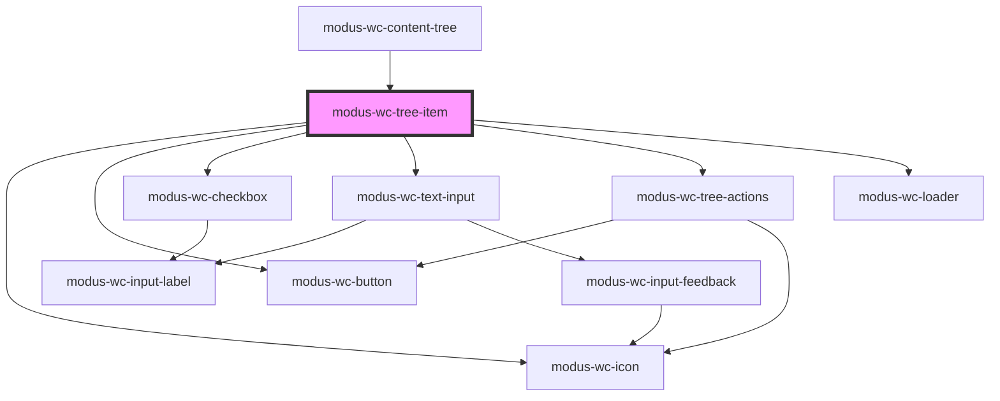

# modus-wc-tree-item

<!-- Auto Generated Below -->

## Overview

A tree item component that represents a single node in a hierarchical tree structure.

## Properties

| Property             | Attribute           | Description                                                                                                                                  | Type                              | Default     |
| -------------------- | ------------------- | -------------------------------------------------------------------------------------------------------------------------------------------- | --------------------------------- | ----------- |
| `checkbox`           | `checkbox`          | If true, renders a checkbox at the start of the tree item.                                                                                   | `boolean \| undefined`            | `false`     |
| `checked`            | `checked`           | The checked state of the tree item when checkbox is enabled.                                                                                 | `boolean \| undefined`            | `undefined` |
| `customClass`        | `custom-class`      | Custom CSS class to apply to the li element.                                                                                                 | `string \| undefined`             | `''`        |
| `disabled`           | `disabled`          | The disabled state of the tree item.                                                                                                         | `boolean \| undefined`            | `undefined` |
| `hasSubtree`         | `has-subtree`       | Whether this tree item has a collapsible subtree. When true, the item will show a caret and handle toggle behavior.                          | `boolean \| undefined`            | `undefined` |
| `inlineLabelEdit`    | `inline-label-edit` | If true, renders an inline editable text input for the label.                                                                                | `boolean \| undefined`            | `false`     |
| `itemsReordering`    | `items-reordering`  | If true, shows a drag handle icon for item reordering UX.                                                                                    | `boolean \| undefined`            | `false`     |
| `label` _(required)_ | `label`             | The text label displayed for the tree item.                                                                                                  | `string`                          | `undefined` |
| `lazyLoading`        | `lazy-loading`      | If true, shows a loader inside the expanded subtree, allowing consumers to signal async data fetching. Set to false once children are ready. | `boolean \| undefined`            | `false`     |
| `selected`           | `selected`          | The selected state of the tree item.                                                                                                         | `boolean \| undefined`            | `undefined` |
| `size`               | `size`              | The size of the tree item icons and actions.                                                                                                 | `"lg" \| "md" \| "sm" \| "xs"`    | `'xs'`      |
| `treeItemActions`    | `tree-item-actions` | Actions to display for this tree item.                                                                                                       | `ITreeItemActions[] \| undefined` | `undefined` |
| `value`              | `value`             | The unique identifying value of the tree item.                                                                                               | `string`                          | `''`        |

## Events

| Event              | Description                                                                          | Type                                                                 |
| ------------------ | ------------------------------------------------------------------------------------ | -------------------------------------------------------------------- |
| `itemExpand`       | Event emitted when a tree item is expanded, useful for triggering lazy data loading. | `CustomEvent<string>`                                                |
| `itemLabelChange`  | Event emitted when inline label editing is completed.                                | `CustomEvent<string>`                                                |
| `itemReordered`    | Event emitted when an item is reordered via drag and drop.                           | `CustomEvent<ITreeItemReorderedEventDetail>`                         |
| `itemSelect`       | Event emitted when a tree item is selected.                                          | `CustomEvent<{ value: string; additive: boolean; range: boolean; }>` |
| `selectionsChange` | Event emitted when checkbox selection changes in multi-select mode.                  | `CustomEvent<{ selectedValues: string[]; }>`                         |

## Methods

### `collapseSubTree() => Promise<void>`

Public method to collapse the subtree if it's expanded

#### Returns

Type: `Promise<void>`

### `expandSubTree() => Promise<void>`

Public method to expand the subtree if it's collapsed

#### Returns

Type: `Promise<void>`

### `setIndeterminateState(indeterminate: boolean) => Promise<void>`

Public method to set the checkbox indeterminate state.

#### Parameters

| Name            | Type      | Description |
| --------------- | --------- | ----------- |
| `indeterminate` | `boolean` |             |

#### Returns

Type: `Promise<void>`

## Dependencies

### Used by

 - [modus-wc-content-tree](..)

### Depends on

- [modus-wc-icon](../../modus-wc-icon)
- [modus-wc-button](../../modus-wc-button)
- [modus-wc-checkbox](../../modus-wc-checkbox)
- [modus-wc-text-input](../../modus-wc-text-input)
- modus-wc-tree-actions
- [modus-wc-loader](../../modus-wc-loader)

### Graph

----------------------------------------------

*Built with [StencilJS](https://stenciljs.com/)*
