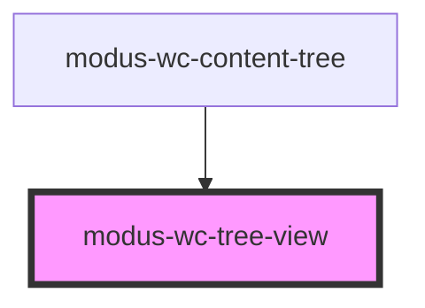

# modus-wc-tree-view

<!-- Auto Generated Below -->

## Overview

A wrapper component that provides the ul element for tree items.
This component uses the modus-wc-menu structure to wrap tree items in a proper list structure.

## Properties

| Property            | Attribute             | Description                                                                                                                                                | Type                    | Default     |
| ------------------- | --------------------- | ---------------------------------------------------------------------------------------------------------------------------------------------------------- | ----------------------- | ----------- |
| `customClass`       | `custom-class`        | Custom CSS class to apply to the ul element.                                                                                                               | `string \| undefined`   | `''`        |
| `isSubList`         | `is-sub-list`         | Indicates that this list is a nested sublist.                                                                                                              | `boolean \| undefined`  | `false`     |
| `multiSelect`       | `multi-select`        | If true, enables multi-select with Ctrl/Cmd and Shift keys. When wrapped by `modus-wc-content-tree`, prefer configuring `multiSelect` on the content tree. | `boolean \| undefined`  | `false`     |
| `selectedValues`    | `selected-values`     | Controlled selected values for tree items. When provided, the tree mirrors this selection state.                                                           | `string[] \| undefined` | `undefined` |
| `showConnectorLine` | `show-connector-line` | If true, shows the connector line for nested sublists.                                                                                                     | `boolean \| undefined`  | `true`      |

## Events

| Event                 | Description                                             | Type                                         |
| --------------------- | ------------------------------------------------------- | -------------------------------------------- |
| `itemSelectionChange` | Emits selected values when tree item selection changes. | `CustomEvent<{ selectedValues: string[]; }>` |

## Dependencies

### Used by

 - [modus-wc-content-tree](..)

### Graph

----------------------------------------------

*Built with [StencilJS](https://stenciljs.com/)*
