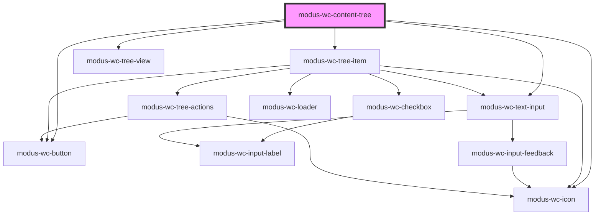

# modus-wc-content-tree

<!-- Auto Generated Below -->

## Overview

A customizable content tree component used to display hierarchical data in a tree structure.

## Properties

| Property            | Attribute            | Description                                                                                                                | Type                           | Default       |
| ------------------- | -------------------- | -------------------------------------------------------------------------------------------------------------------------- | ------------------------------ | ------------- |
| `customClass`       | `custom-class`       | Custom CSS class to apply to the component.                                                                                | `string \| undefined`          | `''`          |
| `includeActions`    | `include-actions`    | If true, displays the action buttons (expand/collapse all, etc.).                                                          | `boolean \| undefined`         | `false`       |
| `includeSearch`     | `include-search`     | If true, displays the search input to filter tree items.                                                                   | `boolean \| undefined`         | `false`       |
| `items`             | `items`              | Data-driven items to render as tree items. When omitted, the component renders slotted content in basic/uncontrolled mode. | `ITreeItemData[] \| undefined` | `undefined`   |
| `itemsReordering`   | `items-reordering`   | If true, enables reordering UI for data-driven `items` trees. Not supported for slot-based trees.                          | `boolean \| undefined`         | `false`       |
| `searchPlaceholder` | `search-placeholder` | Placeholder text for the search input.                                                                                     | `string \| undefined`          | `'Search...'` |

## Events

| Event            | Description                                                                                | Type                                                                               |
| ---------------- | ------------------------------------------------------------------------------------------ | ---------------------------------------------------------------------------------- |
| `itemsReordered` | Emits reordered data for controlled updates/backend sync in data-driven `items` mode only. | `CustomEvent<{ items: ITreeItemData[]; parameters: ITreeItemReorderParameters; }>` |

## Dependencies

### Depends on

- [modus-wc-tree-item](modus-wc-tree-item)
- [modus-wc-icon](../modus-wc-icon)
- [modus-wc-tree-view](modus-wc-tree-view)
- [modus-wc-text-input](../modus-wc-text-input)
- [modus-wc-button](../modus-wc-button)

### Graph

----------------------------------------------

*Built with [StencilJS](https://stenciljs.com/)*
