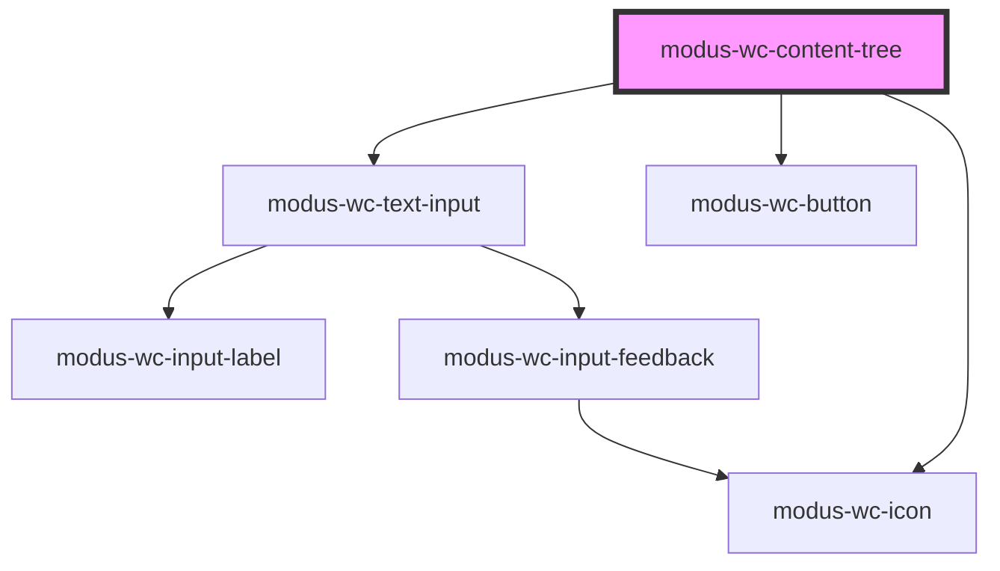

# modus-wc-content-tree

<!-- Auto Generated Below -->

## Overview

A customizable content tree component used to display hierarchical data in a tree structure.
Uses menu items to create the tree structure with support for expanding/collapsing nodes and selection.

## Properties

| Property            | Attribute            | Description                                                                | Type                   | Default       |
| ------------------- | -------------------- | -------------------------------------------------------------------------- | ---------------------- | ------------- |
| `customClass`       | `custom-class`       | Custom CSS class to apply to the component.                                | `string \| undefined`  | `''`          |
| `searchPlaceholder` | `search-placeholder` | Placeholder text for the search input.                                     | `string \| undefined`  | `'Search...'` |
| `showActions`       | `show-actions`       | Whether to show the action bar with add, delete, and collapse all buttons. | `boolean \| undefined` | `false`       |
| `showSearch`        | `show-search`        | Whether to show the search input.                                          | `boolean \| undefined` | `false`       |

## Dependencies

### Depends on

- [modus-wc-text-input](../modus-wc-text-input)
- [modus-wc-button](../modus-wc-button)
- [modus-wc-icon](../modus-wc-icon)

### Graph

----------------------------------------------

*Built with [StencilJS](https://stenciljs.com/)*
