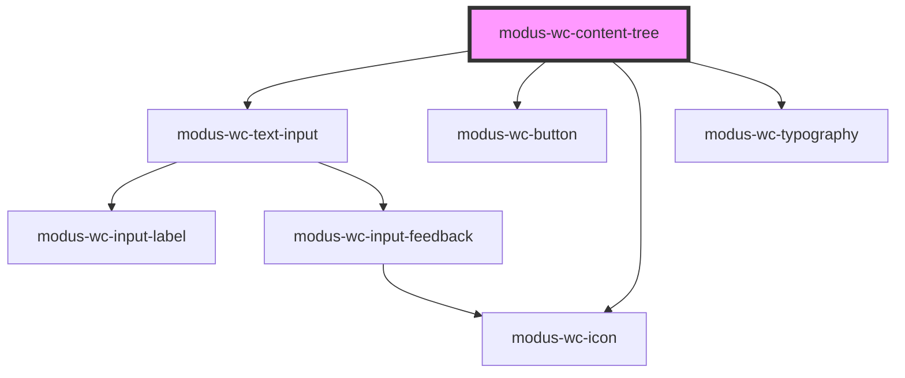

# modus-wc-content-tree

<!-- Auto Generated Below -->

## Overview

A customizable content tree component used to display hierarchical data in a tree structure.

## Properties

| Property            | Attribute            | Description                                                       | Type                   | Default       |
| ------------------- | -------------------- | ----------------------------------------------------------------- | ---------------------- | ------------- |
| `customClass`       | `custom-class`       | Custom CSS class to apply to the component.                       | `string \| undefined`  | `''`          |
| `includeActions`    | `include-actions`    | If true, displays the action buttons (expand/collapse all, etc.). | `boolean \| undefined` | `true`        |
| `includeSearch`     | `include-search`     | If true, displays the search input to filter tree items.          | `boolean \| undefined` | `true`        |
| `searchPlaceholder` | `search-placeholder` | Placeholder text for the search input.                            | `string \| undefined`  | `'Search...'` |

## Dependencies

### Depends on

- [modus-wc-text-input](../modus-wc-text-input)
- [modus-wc-button](../modus-wc-button)
- [modus-wc-icon](../modus-wc-icon)
- [modus-wc-typography](../modus-wc-typography)

### Graph

----------------------------------------------

*Built with [StencilJS](https://stenciljs.com/)*
