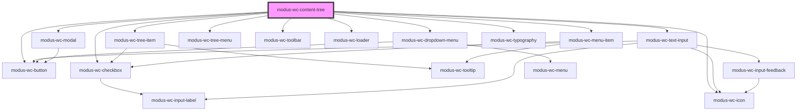

# modus-wc-content-tree

<!-- Auto Generated Below -->

## Overview

A data-driven, stateless/controlled tree component. The consuming application
owns the `nodes` data (the single source of truth) and the controlled
`selectedNodeId` / `expandedNodeIds` state. The component renders the tree and
emits `nodeSelect` / `nodeExpandChange`; the application decides whether to
apply the change and passes the updated state back in.

## Properties

| Property          | Attribute           | Description                                                                                                                                                                                                                                                    | Type                                  | Default     |
| ----------------- | ------------------- | -------------------------------------------------------------------------------------------------------------------------------------------------------------------------------------------------------------------------------------------------------------- | ------------------------------------- | ----------- |
| `allowDragDrop`   | `allow-drag-drop`   | Enables drag-and-drop reordering and reparenting via a per-row drag handle (shown on hover). After a successful drop the component emits `nodeMove` on `dragend`; the application applies it (e.g. via `moveNodeRelative`) and passes updated `nodes` back in. | `boolean \| undefined`                | `undefined` |
| `bordered`        | `bordered`          | Indicates that the content tree should have a border.                                                                                                                                                                                                          | `boolean \| undefined`                | `undefined` |
| `checkedNodeIds`  | `checked-node-ids`  | The ids of the checked leaf nodes (multi-select). Controlled by the consuming application.                                                                                                                                                                     | `string[] \| undefined`               | `undefined` |
| `customClass`     | `custom-class`      | Custom CSS class to apply to the host element.                                                                                                                                                                                                                 | `string \| undefined`                 | `''`        |
| `editingNodeId`   | `editing-node-id`   | The id of the node currently rendered as an inline editable input. Controlled by the consuming application (typically set in response to `nodeEdit`, `nodeAdd`, or `nodeDuplicate`).                                                                           | `string \| undefined`                 | `undefined` |
| `expandedNodeIds` | `expanded-node-ids` | The ids of the currently expanded nodes. Controlled by the consuming application.                                                                                                                                                                              | `string[] \| undefined`               | `undefined` |
| `filter`          | `filter`            | When set, only nodes whose label matches (and their ancestors) are shown. Matching is a case-insensitive substring; matched parents reveal their full subtree. When `searchable` is enabled, this only seeds the built-in search box's initial value.          | `string \| undefined`                 | `''`        |
| `nodes`           | `nodes`             | The tree data. The single source of truth, owned by the consuming application.                                                                                                                                                                                 | `ITreeNode[] \| undefined`            | `undefined` |
| `searchable`      | `searchable`        | Shows a built-in search box above the tree that filters nodes internally (self-managed). When enabled, the search box owns the active filter and the `filter` prop is used only to seed its initial value.                                                     | `boolean \| undefined`                | `undefined` |
| `selectedNodeId`  | `selected-node-id`  | The id of the currently selected (active) node. Controlled by the consuming application.                                                                                                                                                                       | `string \| undefined`                 | `undefined` |
| `selectionMode`   | `selection-mode`    | The selection mode of the content tree.                                                                                                                                                                                                                        | `"multiple" \| "single" \| undefined` | `'single'`  |
| `size`            | `size`              | The size of the content tree items.                                                                                                                                                                                                                            | `"lg" \| "md" \| "sm" \| undefined`   | `'md'`      |
| `toolbar`         | `toolbar`           | Configures the optional toolbar rendered above the tree. When set, a toolbar is shown with the enabled controls: an expand-all / collapse-all toggle and a delete button (enabled only when nodes are checked in multi-select).                                | `IContentTreeToolbar \| undefined`    | `undefined` |

## Events

| Event                  | Description                                                                                                                                                                                                                                                                                                                                                                                                                              | Type                                                                                        |
| ---------------------- | ---------------------------------------------------------------------------------------------------------------------------------------------------------------------------------------------------------------------------------------------------------------------------------------------------------------------------------------------------------------------------------------------------------------------------------------- | ------------------------------------------------------------------------------------------- |
| `expandAllChange`      | Event emitted when the toolbar's expand-all / collapse-all toggle is clicked. The app should set `expandedNodeIds` to every expandable id (e.g. via `getExpandableNodeIds`) when `expanded` is `true`, or to `[]` when `false`.                                                                                                                                                                                                          | `CustomEvent<{ expanded: boolean; }>`                                                       |
| `nodeAdd`              | Event emitted when "Add New Above/Below" or "Add Child Node" is chosen. The app should insert a node at the requested position and set `editingNodeId` to the new id.                                                                                                                                                                                                                                                                    | `CustomEvent<{ referenceId: string; position: "above" \| "below" \| "child"; }>`            |
| `nodeCheckChange`      | Event emitted when a checkbox is toggled (multi-select). The consuming application should update `checkedNodeIds`.                                                                                                                                                                                                                                                                                                                       | `CustomEvent<{ id: string; checked: boolean; }>`                                            |
| `nodeDelete`           | Event emitted after the user confirms deletion. The app should remove the node from `nodes`.                                                                                                                                                                                                                                                                                                                                             | `CustomEvent<{ id: string; }>`                                                              |
| `nodeDuplicate`        | Event emitted when "Duplicate" is chosen. The app should clone the node below it and set `editingNodeId` to the new id.                                                                                                                                                                                                                                                                                                                  | `CustomEvent<{ id: string; }>`                                                              |
| `nodeEdit`             | Event emitted when "Edit name" is chosen. The app should set `editingNodeId` to this id.                                                                                                                                                                                                                                                                                                                                                 | `CustomEvent<{ id: string; }>`                                                              |
| `nodeEditCancel`       | Event emitted when an inline edit ends without an effective change — via Escape, or Enter/blur while the draft matches the original label. The app should clear `editingNodeId` (and discard a freshly added node if its name is still empty).                                                                                                                                                                                           | `CustomEvent<{ id: string; }>`                                                              |
| `nodeExpandChange`     | Event emitted when a node's expansion is toggled. The consuming application should update `expandedNodeIds`.                                                                                                                                                                                                                                                                                                                             | `CustomEvent<{ id: string; expanded: boolean; }>`                                           |
| `nodeLoadChildren`     | Event emitted the first time a lazy node (`hasChildren: true` with no `children` yet) is expanded. The app should fetch the node's children and assign them to `nodes` (use `[]` when there are none); the component shows a spinner until `children` is defined.                                                                                                                                                                        | `CustomEvent<{ id: string; }>`                                                              |
| `nodeMove`             | Event emitted after a successful drag-and-drop, once the gesture ends (`dragend`). Emitting on `dragend` (not `drop`) keeps the drag source in the DOM until the browser finishes the gesture, so applying the move (e.g. via `moveNodeRelative`) cannot tear down the handle mid-drag. `position` is relative to `targetId`: `before`/`after` reorder among the target's siblings; `inside` nests the node as the target's first child. | `CustomEvent<{ id: string; targetId: string; position: "after" \| "before" \| "inside"; }>` |
| `nodeRename`           | Event emitted when an inline edit is committed with an effective label change (via Enter or losing focus). The app should apply the new label and clear `editingNodeId`.                                                                                                                                                                                                                                                                 | `CustomEvent<{ id: string; label: string; }>`                                               |
| `nodesDelete`          | Event emitted when the toolbar's delete button is confirmed. `ids` are the top-most checked nodes; the app should remove them (e.g. via `deleteNodes`).                                                                                                                                                                                                                                                                                  | `CustomEvent<{ ids: string[]; }>`                                                           |
| `nodeSelect`           | Event emitted when a node is selected. The consuming application should update `selectedNodeId`.                                                                                                                                                                                                                                                                                                                                         | `CustomEvent<{ id: string; }>`                                                              |
| `nodeVisibilityChange` | Event emitted when a node's visibility (eye) toggle is clicked. `disabled` is the new state. The app should update the node's own `disabled` state (e.g. via `setNodeDisabled`); descendants become effectively disabled via ancestor inheritance.                                                                                                                                                                                       | `CustomEvent<{ id: string; disabled: boolean; }>`                                           |

## Dependencies

### Depends on

- [modus-wc-tree-item](../modus-wc-tree-item)
- [modus-wc-button](../modus-wc-button)
- [modus-wc-icon](../modus-wc-icon)
- [modus-wc-checkbox](../modus-wc-checkbox)
- [modus-wc-text-input](../modus-wc-text-input)
- [modus-wc-dropdown-menu](../modus-wc-dropdown-menu)
- [modus-wc-menu-item](../modus-wc-menu-item)
- [modus-wc-tree-menu](../modus-wc-tree-menu)
- [modus-wc-toolbar](../modus-wc-toolbar)
- [modus-wc-loader](../modus-wc-loader)
- [modus-wc-modal](../modus-wc-modal)
- [modus-wc-typography](../modus-wc-typography)

### Graph

```mermaid
graph TD;
  modus-wc-content-tree --> modus-wc-tree-item
  modus-wc-content-tree --> modus-wc-button
  modus-wc-content-tree --> modus-wc-icon
  modus-wc-content-tree --> modus-wc-checkbox
  modus-wc-content-tree --> modus-wc-text-input
  modus-wc-content-tree --> modus-wc-dropdown-menu
  modus-wc-content-tree --> modus-wc-menu-item
  modus-wc-content-tree --> modus-wc-tree-menu
  modus-wc-content-tree --> modus-wc-toolbar
  modus-wc-content-tree --> modus-wc-loader
  modus-wc-content-tree --> modus-wc-modal
  modus-wc-content-tree --> modus-wc-typography
  modus-wc-tree-item --> modus-wc-checkbox
  modus-wc-tree-item --> modus-wc-tooltip
  modus-wc-checkbox --> modus-wc-input-label
  modus-wc-text-input --> modus-wc-input-label
  modus-wc-text-input --> modus-wc-icon
  modus-wc-text-input --> modus-wc-button
  modus-wc-text-input --> modus-wc-input-feedback
  modus-wc-input-feedback --> modus-wc-icon
  modus-wc-dropdown-menu --> modus-wc-button
  modus-wc-dropdown-menu --> modus-wc-menu
  modus-wc-menu-item --> modus-wc-checkbox
  modus-wc-menu-item --> modus-wc-tooltip
  modus-wc-modal --> modus-wc-button
  style modus-wc-content-tree fill:#f9f,stroke:#333,stroke-width:4px
```

----------------------------------------------

*Built with [StencilJS](https://stenciljs.com/)*
