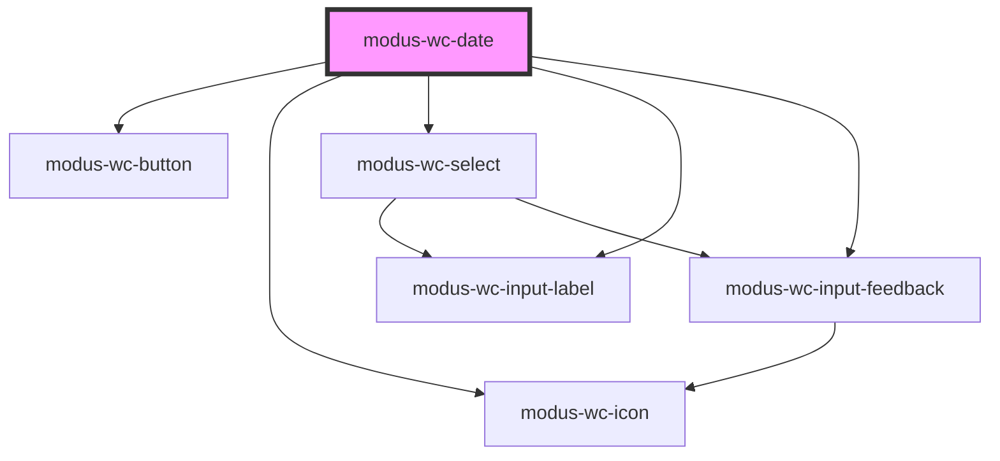

# modus-wc-date

<!-- Auto Generated Below -->

## Overview

A customizable date picker component used to create date inputs.

Adheres to WCAG 2.2 standards.

## Properties

| Property          | Attribute           | Description                                                                                                                                                                                                                                                                                                                                     | Type                                                                                                    | Default     |
| ----------------- | ------------------- | ----------------------------------------------------------------------------------------------------------------------------------------------------------------------------------------------------------------------------------------------------------------------------------------------------------------------------------------------- | ------------------------------------------------------------------------------------------------------- | ----------- |
| `bordered`        | `bordered`          | Indicates that the input should have a border.                                                                                                                                                                                                                                                                                                  | `boolean \| undefined`                                                                                  | `true`      |
| `customClass`     | `custom-class`      | Custom CSS class to apply to the input.                                                                                                                                                                                                                                                                                                         | `string \| undefined`                                                                                   | `''`        |
| `disabled`        | `disabled`          | Whether the form control is disabled.                                                                                                                                                                                                                                                                                                           | `boolean \| undefined`                                                                                  | `false`     |
| `feedback`        | `feedback`          | Feedback to render below the input.                                                                                                                                                                                                                                                                                                             | `IInputFeedbackProp \| undefined`                                                                       | `undefined` |
| `format`          | `format`            | The date format used for both display and user input. Automatically derived from the user's locale when not explicitly set. Supported tokens: `dd`, `mm`, `yyyy` (numeric separators /, -, .) and `MMM DD, YYYY` for abbreviated month names (e.g. `Oct 15, 2025`). Examples: `'dd/mm/yyyy'`, `'mm-dd-yyyy'`, `'yyyy.mm.dd'`, `'MMM DD, YYYY'`. | `string \| undefined`                                                                                   | `undefined` |
| `inputId`         | `input-id`          | The ID of the input element.                                                                                                                                                                                                                                                                                                                    | `string \| undefined`                                                                                   | `undefined` |
| `inputTabIndex`   | `input-tab-index`   | Determine the control's relative ordering for sequential focus navigation (typically with the Tab key).                                                                                                                                                                                                                                         | `number \| undefined`                                                                                   | `undefined` |
| `label`           | `label`             | The text to display within the label.                                                                                                                                                                                                                                                                                                           | `string \| undefined`                                                                                   | `undefined` |
| `max`             | `max`               | Maximum date value.                                                                                                                                                                                                                                                                                                                             | `string \| undefined`                                                                                   | `undefined` |
| `min`             | `min`               | Minimum date value.                                                                                                                                                                                                                                                                                                                             | `string \| undefined`                                                                                   | `undefined` |
| `name`            | `name`              | Name of the form control. Submitted with the form as part of a name/value pair.                                                                                                                                                                                                                                                                 | `string \| undefined`                                                                                   | `undefined` |
| `readOnly`        | `read-only`         | Whether the value is editable.                                                                                                                                                                                                                                                                                                                  | `boolean \| undefined`                                                                                  | `false`     |
| `required`        | `required`          | A value is required or must be checked for the form to be submittable.                                                                                                                                                                                                                                                                          | `boolean \| undefined`                                                                                  | `false`     |
| `showWeekNumbers` | `show-week-numbers` | Displays ISO 8601 week numbers in the calendar. Week numbers are calculated with Monday as the first day of the week.                                                                                                                                                                                                                           | `boolean \| undefined`                                                                                  | `false`     |
| `size`            | `size`              | The size of the input.                                                                                                                                                                                                                                                                                                                          | `"lg" \| "md" \| "sm" \| undefined`                                                                     | `'md'`      |
| `value`           | `value`             | The value of the control.                                                                                                                                                                                                                                                                                                                       | `string`                                                                                                | `''`        |
| `weekStartDay`    | `week-start-day`    | The first day of the week for the calendar display                                                                                                                                                                                                                                                                                              | `"friday" \| "monday" \| "saturday" \| "sunday" \| "thursday" \| "tuesday" \| "wednesday" \| undefined` | `'sunday'`  |

## Events

| Event                 | Description                                              | Type                      |
| --------------------- | -------------------------------------------------------- | ------------------------- |
| `calendarMonthChange` | Event emitted when the calendar month selection changes. | `CustomEvent<number>`     |
| `calendarYearChange`  | Event emitted when the calendar year selection changes.  | `CustomEvent<number>`     |
| `inputBlur`           | Event emitted when the input loses focus.                | `CustomEvent<FocusEvent>` |
| `inputChange`         | Event emitted when the input value changes.              | `CustomEvent<InputEvent>` |
| `inputFocus`          | Event emitted when the input gains focus.                | `CustomEvent<FocusEvent>` |

## Dependencies

### Depends on

- [modus-wc-button](../modus-wc-button)
- [modus-wc-icon](../modus-wc-icon)
- [modus-wc-select](../modus-wc-select)
- [modus-wc-input-label](../modus-wc-input-label)
- [modus-wc-input-feedback](../modus-wc-input-feedback)

### Graph

----------------------------------------------

*Built with [StencilJS](https://stenciljs.com/)*
