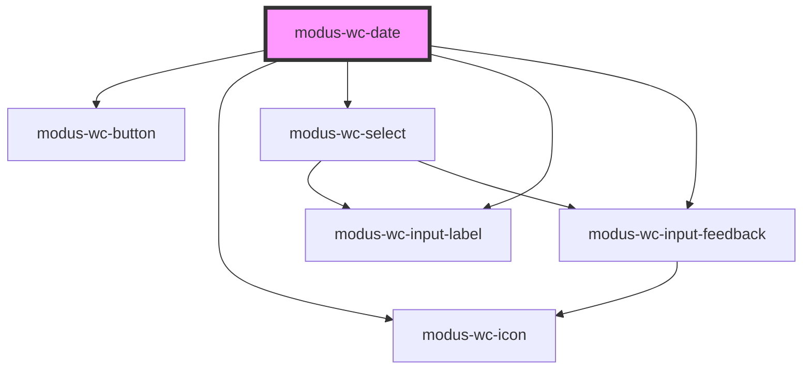

# modus-wc-date

<!-- Auto Generated Below -->

## Overview

A customizable date picker component used to create date inputs.

Adheres to WCAG 2.2 standards.

## Properties

| Property            | Attribute             | Description                                                                                                                                                                                                                        | Type                                                                                                                          | Default     |
| ------------------- | --------------------- | ---------------------------------------------------------------------------------------------------------------------------------------------------------------------------------------------------------------------------------- | ----------------------------------------------------------------------------------------------------------------------------- | ----------- |
| `bordered`          | `bordered`            | Indicates that the input should have a border.                                                                                                                                                                                     | `boolean \| undefined`                                                                                                        | `true`      |
| `customClass`       | `custom-class`        | Custom CSS class to apply to the input.                                                                                                                                                                                            | `string \| undefined`                                                                                                         | `''`        |
| `disabled`          | `disabled`            | Whether the form control is disabled.                                                                                                                                                                                              | `boolean \| undefined`                                                                                                        | `false`     |
| `endValue`          | `end-value`           | The end date in range mode (`type="range"`). Must match the `format` prop pattern (or the locale-derived format when unset) or ISO 8601 (`YYYY-MM-DD`). Empty string when unset. Ignored in single mode.                           | `string`                                                                                                                      | `''`        |
| `feedback`          | `feedback`            | Feedback to render below the input.                                                                                                                                                                                                | `IInputFeedbackProp \| undefined`                                                                                             | `undefined` |
| `format`            | `format`              | The date format for display and input.                                                                                                                                                                                             | `"MMM DD, YYYY" \| "dd-mm-yyyy" \| "dd/mm/yyyy" \| "mm-dd-yyyy" \| "mm/dd/yyyy" \| "yyyy-mm-dd" \| "yyyy/mm/dd" \| undefined` | `undefined` |
| `hideOverflowDates` | `hide-overflow-dates` | When omitted, defaults to `true` in range mode and `false` in single mode.                                                                                                                                                         | `boolean \| undefined`                                                                                                        | `undefined` |
| `inputId`           | `input-id`            | The ID of the start input in single mode. In range mode, the end input id is `{inputId}-end` (or `{generated-id}-end` when omitted). There is no separate prop for the end input id.                                               | `string \| undefined`                                                                                                         | `undefined` |
| `inputTabIndex`     | `input-tab-index`     | Determine the control's relative ordering for sequential focus navigation (typically with the Tab key).                                                                                                                            | `number \| undefined`                                                                                                         | `undefined` |
| `label`             | `label`               | The text to display within the label.                                                                                                                                                                                              | `string \| undefined`                                                                                                         | `undefined` |
| `max`               | `max`                 | Maximum date value. Must match the `format` prop pattern (or the locale-derived format when unset) or ISO 8601 (`YYYY-MM-DD`).                                                                                                     | `string \| undefined`                                                                                                         | `undefined` |
| `min`               | `min`                 | Minimum date value. Must match the `format` prop pattern (or the locale-derived format when unset) or ISO 8601 (`YYYY-MM-DD`).                                                                                                     | `string \| undefined`                                                                                                         | `undefined` |
| `name`              | `name`                | Name of the form control. In range mode, the end input name is `{name}-end`. There is no separate prop for the end input name.                                                                                                     | `string \| undefined`                                                                                                         | `undefined` |
| `readOnly`          | `read-only`           | Whether the value is editable.                                                                                                                                                                                                     | `boolean \| undefined`                                                                                                        | `false`     |
| `required`          | `required`            | A value is required or must be checked for the form to be submittable.                                                                                                                                                             | `boolean \| undefined`                                                                                                        | `false`     |
| `showWeekNumbers`   | `show-week-numbers`   | Displays ISO 8601 week numbers in the calendar. Week numbers are calculated with Monday as the first day of the week.                                                                                                              | `boolean \| undefined`                                                                                                        | `false`     |
| `size`              | `size`                | The size of the input.                                                                                                                                                                                                             | `"lg" \| "md" \| "sm" \| undefined`                                                                                           | `'md'`      |
| `type`              | `type`                | Activates range mode. `value` is the start date; `endValue` is the end date.                                                                                                                                                       | `"range" \| "single" \| undefined`                                                                                            | `'single'`  |
| `value`             | `value`               | The selected date in single mode. In range mode (`type="range"`), the start date of the range. Must match the `format` prop pattern (or the locale-derived format when unset) or ISO 8601 (`YYYY-MM-DD`). Empty string when unset. | `string`                                                                                                                      | `''`        |
| `weekStartDay`      | `week-start-day`      | The first day of the week for the calendar display                                                                                                                                                                                 | `"friday" \| "monday" \| "saturday" \| "sunday" \| "thursday" \| "tuesday" \| "wednesday" \| undefined`                       | `'sunday'`  |

## Events

| Event                    | Description                                                                                                                                                                                    | Type                      |
| ------------------------ | ---------------------------------------------------------------------------------------------------------------------------------------------------------------------------------------------- | ------------------------- |
| `calendarMonthChange`    | Event emitted when the start (or single-mode) calendar month selection changes.                                                                                                                | `CustomEvent<number>`     |
| `calendarYearChange`     | Event emitted when the start (or single-mode) calendar year selection changes.                                                                                                                 | `CustomEvent<number>`     |
| `endCalendarMonthChange` | Event emitted when the end calendar month selection changes in range mode.                                                                                                                     | `CustomEvent<number>`     |
| `endCalendarYearChange`  | Event emitted when the end calendar year selection changes in range mode.                                                                                                                      | `CustomEvent<number>`     |
| `inputBlur`              | Event emitted when the input loses focus. In range mode, `detail.field` is `'start'` or `'end'`.                                                                                               | `CustomEvent<FocusEvent>` |
| `inputChange`            | Event emitted when the input value changes. `target.value` is always ISO 8601 (YYYY-MM-DD), or empty string when incomplete or invalid. In range mode, `detail.field` is `'start'` or `'end'`. | `CustomEvent<InputEvent>` |
| `inputFocus`             | Event emitted when the input gains focus. In range mode, `detail.field` is `'start'` or `'end'`.                                                                                               | `CustomEvent<FocusEvent>` |
| `rangeChange`            | Event emitted when a complete date range is selected in range mode.                                                                                                                            | `CustomEvent<IDateRange>` |

## Dependencies

### Depends on

- [modus-wc-button](../modus-wc-button)
- [modus-wc-icon](../modus-wc-icon)
- [modus-wc-select](../modus-wc-select)
- [modus-wc-input-label](../modus-wc-input-label)
- [modus-wc-input-feedback](../modus-wc-input-feedback)

### Graph

```mermaid
graph TD;
  modus-wc-date --> modus-wc-button
  modus-wc-date --> modus-wc-icon
  modus-wc-date --> modus-wc-select
  modus-wc-date --> modus-wc-input-label
  modus-wc-date --> modus-wc-input-feedback
  modus-wc-select --> modus-wc-input-label
  modus-wc-select --> modus-wc-input-feedback
  modus-wc-input-feedback --> modus-wc-icon
  style modus-wc-date fill:#f9f,stroke:#333,stroke-width:4px
```

----------------------------------------------

*Built with [StencilJS](https://stenciljs.com/)*
