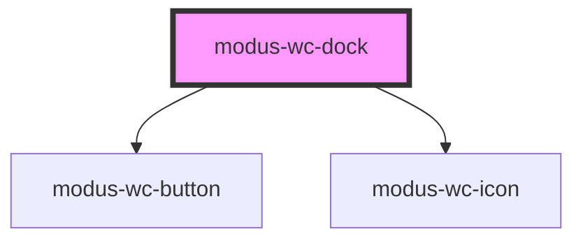

# modus-wc-dock

<!-- Auto Generated Below -->

## Overview

Dock navigation bar for navigating between primary screens.

## Properties

| Property          | Attribute           | Description                                                                         | Type                                     | Default    |
| ----------------- | ------------------- | ----------------------------------------------------------------------------------- | ---------------------------------------- | ---------- |
| `activeItemIndex` | `active-item-index` | The currently active dock item index.                                               | `number`                                 | `0`        |
| `customClass`     | `custom-class`      | Custom CSS class to apply to the inner nav element.                                 | `string`                                 | `''`       |
| `items`           | `items`             | The dock items to display.                                                          | `IDockItem[]`                            | `[]`       |
| `position`        | `position`          | The edge the dock is anchored to. Controls layout and active indicator orientation. | `"bottom" \| "left" \| "right" \| "top"` | `'bottom'` |
| `showLabels`      | `show-labels`       | If true, text labels are shown below icons.                                         | `boolean`                                | `true`     |
| `size`            | `size`              | The size of the dock items.                                                         | `"lg" \| "md" \| "sm"`                   | `'md'`     |

## Events

| Event        | Description                           | Type                                               |
| ------------ | ------------------------------------- | -------------------------------------------------- |
| `itemSelect` | Emitted when a dock item is selected. | `CustomEvent<{ index: number; item: IDockItem; }>` |

## Dependencies

### Depends on

- [modus-wc-button](../modus-wc-button)
- [modus-wc-icon](../modus-wc-icon)

### Graph

----------------------------------------------

*Built with [StencilJS](https://stenciljs.com/)*
