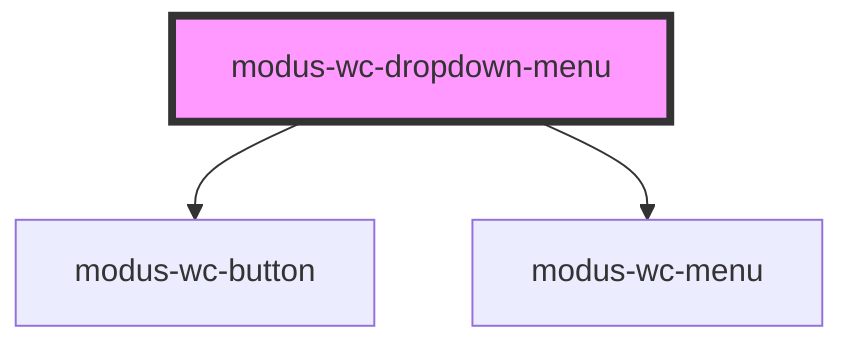

# modus-wc-dropdown-menu

<!-- Auto Generated Below -->

## Overview

A customizable dropdown menu component used to render a button and toggleable menu.

The component supports a 'button' and 'menu' `<slot>` for injecting custom HTML content.

## Properties

| Property          | Attribute           | Description                                       | Type                                                                                                                                                                              | Default          |
| ----------------- | ------------------- | ------------------------------------------------- | --------------------------------------------------------------------------------------------------------------------------------------------------------------------------------- | ---------------- |
| `anchorSelector`  | `anchor-selector`   |                                                   | `string \| undefined`                                                                                                                                                             | `undefined`      |
| `buttonAriaLabel` | `button-aria-label` | The aria-label for the dropdown button.           | `string \| undefined`                                                                                                                                                             | `undefined`      |
| `buttonColor`     | `button-color`      | The color variant of the button.                  | `"danger" \| "primary" \| "secondary" \| "tertiary" \| "warning" \| undefined`                                                                                                    | `'primary'`      |
| `buttonSize`      | `button-size`       | The size of the button.                           | `"lg" \| "md" \| "sm" \| "xs" \| undefined`                                                                                                                                       | `'md'`           |
| `buttonVariant`   | `button-variant`    | The variant of the button.                        | `"borderless" \| "filled" \| "outlined" \| undefined`                                                                                                                             | `'filled'`       |
| `customClass`     | `custom-class`      | Custom CSS class to apply to the host element.    | `string \| undefined`                                                                                                                                                             | `''`             |
| `disabled`        | `disabled`          | If true, the button will be disabled.             | `boolean \| undefined`                                                                                                                                                            | `false`          |
| `menuBordered`    | `menu-bordered`     | Indicates that the menu should have a border.     | `boolean \| undefined`                                                                                                                                                            | `true`           |
| `menuOffset`      | `menu-offset`       | Distance between the button and menu in pixels.   | `number \| undefined`                                                                                                                                                             | `10`             |
| `menuPlacement`   | `menu-placement`    | The placement of the menu relative to the button. | `"bottom" \| "bottom-end" \| "bottom-start" \| "left" \| "left-end" \| "left-start" \| "right" \| "right-end" \| "right-start" \| "top" \| "top-end" \| "top-start" \| undefined` | `'bottom-start'` |
| `menuSize`        | `menu-size`         | The size of the menu.                             | `"lg" \| "md" \| "sm" \| undefined`                                                                                                                                               | `'md'`           |
| `menuVisible`     | `menu-visible`      | Indicates that the menu is visible.               | `boolean`                                                                                                                                                                         | `false`          |

## Events

| Event                  | Description                                      | Type                                   |
| ---------------------- | ------------------------------------------------ | -------------------------------------- |
| `menuVisibilityChange` | Event emitted when the menuVisible prop changes. | `CustomEvent<{ isVisible: boolean; }>` |

## Dependencies

### Depends on

- [modus-wc-button](../modus-wc-button)
- [modus-wc-menu](../modus-wc-menu)

### Graph

----------------------------------------------

*Built with [StencilJS](https://stenciljs.com/)*
