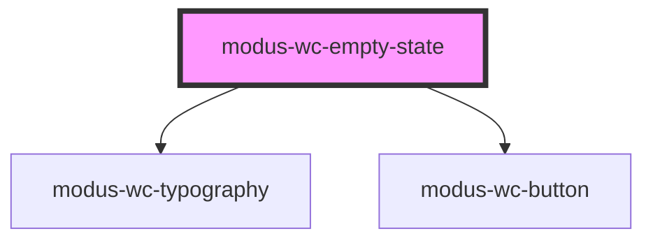

# modus-wc-empty-state

<!-- Auto Generated Below -->

## Overview

Presents a centered empty, error, or placeholder state with bundled illustrations,
heading, optional subtitle, and an optional call-to-action.

## Properties

| Property               | Attribute      | Description                                                                                                                                                                                                                                 | Type                                                                                                                                                                        | Default     |
| ---------------------- | -------------- | ------------------------------------------------------------------------------------------------------------------------------------------------------------------------------------------------------------------------------------------- | --------------------------------------------------------------------------------------------------------------------------------------------------------------------------- | ----------- |
| `actionLabel`          | `action-label` | When set, renders a centered primary action button with this label.                                                                                                                                                                         | `string \| undefined`                                                                                                                                                       | `undefined` |
| `customClass`          | `custom-class` | Custom CSS class for the root container.                                                                                                                                                                                                    | `string \| undefined`                                                                                                                                                       | `''`        |
| `heading` _(required)_ | `heading`      | Primary heading text.                                                                                                                                                                                                                       | `string`                                                                                                                                                                    | `undefined` |
| `illustration`         | `illustration` | Bundled illustration name. Valid values depend on `variant`: compact — `selection_plus`, `symbol_info`, `add_user`; illustration — `landscape`, `documents_empty`, `cloud_access`, `store_settings`, `error_404`; error — `page_not_found`. | `"add_user" \| "cloud_access" \| "documents_empty" \| "error_404" \| "landscape" \| "page_not_found" \| "selection_plus" \| "store_settings" \| "symbol_info" \| undefined` | `undefined` |
| `subtitle`             | `subtitle`     | Secondary descriptive text (clamped to three lines in the layout).                                                                                                                                                                          | `string \| undefined`                                                                                                                                                       | `undefined` |
| `variant`              | `variant`      | Layout variant: compact icon, full illustration, or dedicated error (404) treatment.                                                                                                                                                        | `"compact" \| "error" \| "illustration"`                                                                                                                                    | `'compact'` |

## Events

| Event         | Description                                         | Type                                       |
| ------------- | --------------------------------------------------- | ------------------------------------------ |
| `actionClick` | Fires when the optional action button is activated. | `CustomEvent<KeyboardEvent \| MouseEvent>` |

## Dependencies

### Depends on

- [modus-wc-typography](../modus-wc-typography)
- [modus-wc-button](../modus-wc-button)

### Graph

----------------------------------------------

*Built with [StencilJS](https://stenciljs.com/)*
