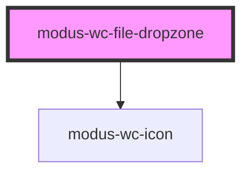

# modus-wc-file-dropzone

<!-- Auto Generated Below -->

## Overview

File dropzone component that allows users to drag and drop files for upload.

The component supports a `<slot>` called 'dropzone' for adding custom content such as progress indicators or additional instructions within the dropzone area.

## Properties

| Property                      | Attribute                        | Description                                                           | Type                   | Default     |
| ----------------------------- | -------------------------------- | --------------------------------------------------------------------- | ---------------------- | ----------- |
| `acceptFileTypes`             | `accept-file-types`              | Accepted file types (e.g. '.jpg,.png' or 'image/*')                   | `string \| undefined`  | `undefined` |
| `customClass`                 | `custom-class`                   | Custom CSS class to apply to the file dropzone element                | `string \| undefined`  | `''`        |
| `disabled`                    | `disabled`                       | Disable the file input                                                | `boolean \| undefined` | `undefined` |
| `fileDraggedOverInstructions` | `file-dragged-over-instructions` | Custom instructions shown when files are dragged over the dropzone    | `string \| undefined`  | `undefined` |
| `includeStateIcon`            | `include-state-icon`             | Include state icon (upload, success, error)                           | `boolean \| undefined` | `true`      |
| `instructions`                | `instructions`                   | Custom instructions shown as the default dropzone message             | `string \| undefined`  | `undefined` |
| `invalidFileTypeMessage`      | `invalid-file-type-message`      | Custom error message displayed when an invalid file type is selected  | `string \| undefined`  | `undefined` |
| `maxFileCount`                | `max-file-count`                 | Maximum number of files allowed, will show error if exceeded          | `number \| undefined`  | `undefined` |
| `maxFileNameLength`           | `max-file-name-length`           | Maximum allowed length of filename, will show error if exceeded       | `number \| undefined`  | `undefined` |
| `maxTotalFileSizeBytes`       | `max-total-file-size-bytes`      | Maximum total file size in bytes allowed, will show error if exceeded | `number \| undefined`  | `undefined` |
| `multiple`                    | `multiple`                       | Allow multiple file selection                                         | `boolean \| undefined` | `undefined` |
| `successMessage`              | `success-message`                | Success message displayed when files are uploaded successfully        | `string \| undefined`  | `undefined` |

## Events

| Event        | Description                           | Type                    |
| ------------ | ------------------------------------- | ----------------------- |
| `fileSelect` | Event emitted when files are selected | `CustomEvent<FileList>` |

## Methods

### `reset() => Promise<void>`

Reset the dropzone to its initial state, clearing all error and success states

#### Returns

Type: `Promise<void>`

## Dependencies

### Depends on

- [modus-wc-icon](../modus-wc-icon)

### Graph

----------------------------------------------

*Built with [StencilJS](https://stenciljs.com/)*
