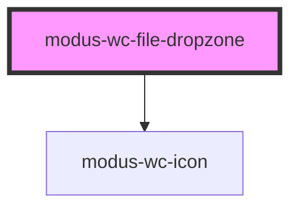

# modus-wc-file-dropzone

<!-- Auto Generated Below -->

## Overview

File dropzone component that allows users to drag and drop files for upload.

## Properties

| Property   | Attribute  | Description                         | Type                   | Default     |
| ---------- | ---------- | ----------------------------------- | ---------------------- | ----------- |
| `disabled` | `disabled` | Disable the file input              | `boolean \| undefined` | `undefined` |
| `label`    | `label`    | Label to display for the file input | `string \| undefined`  | `undefined` |
| `multiple` | `multiple` | Allow multiple file selection       | `boolean \| undefined` | `undefined` |

## Events

| Event        | Description                           | Type                    |
| ------------ | ------------------------------------- | ----------------------- |
| `fileSelect` | Event emitted when files are selected | `CustomEvent<FileList>` |

## Dependencies

### Depends on

- [modus-wc-icon](../modus-wc-icon)

### Graph

----------------------------------------------

*Built with [StencilJS](https://stenciljs.com/)*
