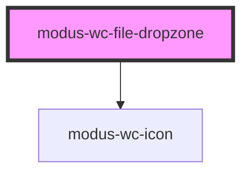

# modus-wc-file-dropzone

<!-- Auto Generated Below -->

## Overview

File dropzone component that allows users to drag and drop files for upload.

## Properties

| Property                      | Attribute                        | Description                                                          | Type                   | Default     |
| ----------------------------- | -------------------------------- | -------------------------------------------------------------------- | ---------------------- | ----------- |
| `acceptFileTypes`             | `accept-file-types`              | Accepted file types (e.g. '.jpg,.png' or 'image/*')                  | `string \| undefined`  | `undefined` |
| `disabled`                    | `disabled`                       | Disable the file input                                               | `boolean \| undefined` | `undefined` |
| `fileDraggedOverInstructions` | `file-dragged-over-instructions` | Custom instructions shown when files are dragged over the dropzone   | `string \| undefined`  | `undefined` |
| `instructions`                | `instructions`                   | Custom instructions shown as the default dropzone message            | `string \| undefined`  | `undefined` |
| `invalidFileTypeMessage`      | `invalid-file-type-message`      | Custom error message displayed when an invalid file type is selected | `string \| undefined`  | `undefined` |
| `successMessage`              | `success-message`                | Success message displayed when files are uploaded successfully       | `string \| undefined`  | `undefined` |

## Events

| Event        | Description                           | Type                    |
| ------------ | ------------------------------------- | ----------------------- |
| `fileSelect` | Event emitted when files are selected | `CustomEvent<FileList>` |

## Dependencies

### Depends on

- [modus-wc-icon](../modus-wc-icon)

### Graph

----------------------------------------------

*Built with [StencilJS](https://stenciljs.com/)*
