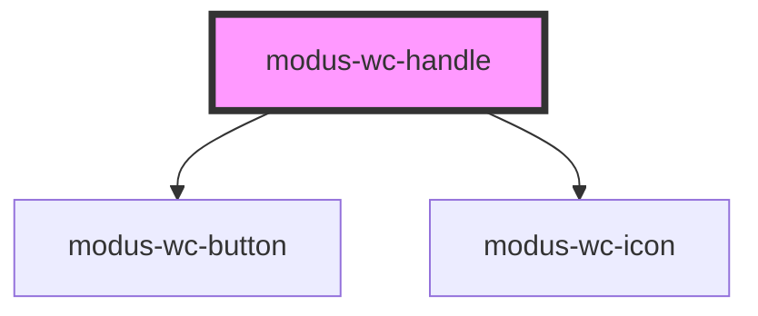

# modus-wc-handle

<!-- Auto Generated Below -->

## Overview

A draggable handle component for resizing adjacent elements

## Properties

| Property      | Attribute      | Description                                                                                   | Type                                                   | Default         |
| ------------- | -------------- | --------------------------------------------------------------------------------------------- | ------------------------------------------------------ | --------------- |
| `customClass` | `custom-class` | Custom CSS class to apply to the handle element.                                              | `string \| undefined`                                  | `''`            |
| `density`     | `density`      | The density/spacing of the handle container (compact: 8px, comfortable: 12px, relaxed: 16px). | `"comfortable" \| "compact" \| "relaxed" \| undefined` | `'comfortable'` |
| `leftTarget`  | `left-target`  | The left target element to resize (CSS selector or HTMLElement)                               | `HTMLElement \| string \| undefined`                   | `undefined`     |
| `orientation` | `orientation`  | The orientation of the handle.                                                                | `"horizontal" \| "vertical" \| undefined`              | `'horizontal'`  |
| `rightTarget` | `right-target` | The right target element to resize (CSS selector or HTMLElement)                              | `HTMLElement \| string \| undefined`                   | `undefined`     |
| `size`        | `size`         | The size of the handle.                                                                       | `"2xl" \| "default" \| "lg" \| "xl" \| undefined`      | `'default'`     |
| `type`        | `type`         | The type of handle to display.                                                                | `"bar" \| "button" \| undefined`                       | `'bar'`         |

## Dependencies

### Depends on

- [modus-wc-button](../modus-wc-button)
- [modus-wc-icon](../modus-wc-icon)

### Graph

----------------------------------------------

*Built with [StencilJS](https://stenciljs.com/)*
