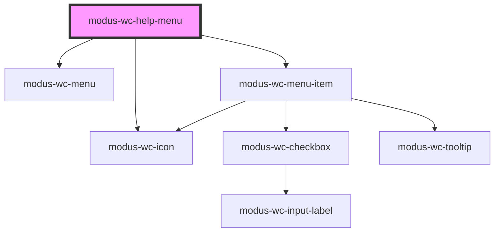

# modus-wc-help-menu

<!-- Auto Generated Below -->

## Overview

A drill-down menu used inside a dropdown. Items that contain a `slot="panel"`
menu show a right-pointing chevron and slide to that panel. A Back control
and the parent item's label (without its icon) head each nested panel.

## Events

| Event         | Description                             | Type                                             |
| ------------- | --------------------------------------- | ------------------------------------------------ |
| `panelChange` | Emitted when the visible panel changes. | `CustomEvent<{ depth: number; label: string; }>` |

## Methods

### `reset() => Promise<void>`

Clears the panel stack and returns to the root items.

#### Returns

Type: `Promise<void>`

## Dependencies

### Depends on

- [modus-wc-icon](../modus-wc-icon)
- [modus-wc-menu](../modus-wc-menu)
- [modus-wc-menu-item](../modus-wc-menu-item)

### Graph

----------------------------------------------

*Built with [StencilJS](https://stenciljs.com/)*
