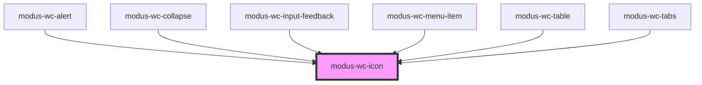

# modus-wc-icon

<!-- Auto Generated Below -->

## Overview

A customizable icon component used to render Modus icons.

<b>This component requires Modus icons to be installed in the host application. See [Modus Icon Usage](/docs/documentation-modus-icon-usage--docs) for steps.</b>

<b>For custom icons:</b> Use the default slot to pass any icon content (Connect icons, SVGs, etc.). The component automatically preserves icon font families.

## Properties

| Property            | Attribute      | Description                                                                                                              | Type                                        | Default     |
| ------------------- | -------------- | ------------------------------------------------------------------------------------------------------------------------ | ------------------------------------------- | ----------- |
| `customClass`       | `custom-class` | Custom CSS class to apply to the icon element.                                                                           | `string \| undefined`                       | `''`        |
| `decorative`        | `decorative`   | Indicates that the icon is decorative. When true, sets aria-hidden to hide the icon from screen readers.                 | `boolean \| undefined`                      | `true`      |
| `name` _(required)_ | `name`         | The icon name, should match the CSS class in the icon font.                                                              | `string`                                    | `undefined` |
| `size`              | `size`         | The icon size, can be "sm", "md", "lg" (a custom size can be specified in CSS). This adjusts the font size for the icon. | `"lg" \| "md" \| "sm" \| "xs" \| undefined` | `'md'`      |

## Dependencies

### Used by

 - [modus-wc-alert](../modus-wc-alert)
 - [modus-wc-collapse](../modus-wc-collapse)
 - [modus-wc-input-feedback](../modus-wc-input-feedback)
 - [modus-wc-menu-item](../modus-wc-menu-item)
 - [modus-wc-table](../modus-wc-table)
 - [modus-wc-tabs](../modus-wc-tabs)

### Graph

----------------------------------------------

*Built with [StencilJS](https://stenciljs.com/)*
