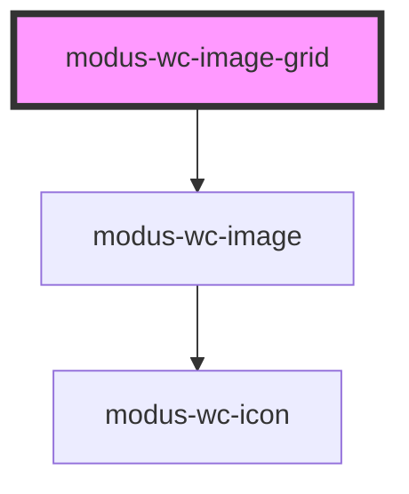

# modus-wc-image-grid

<!-- Auto Generated Below -->

## Overview

A responsive image grid that displays 1 to 4 images in rectangle or square layouts.

Each cell is rendered with `modus-wc-image` for consistent cropping, rounded corners, and fallback behavior.
Grid layout CSS fills each cell; per-image dimensional `size` tokens on `modus-wc-image` are not exposed on `IImageGridImage`.

## Properties

| Property        | Attribute         | Description                                                                                | Type                                   | Default       |
| --------------- | ----------------- | ------------------------------------------------------------------------------------------ | -------------------------------------- | ------------- |
| `customClass`   | `custom-class`    | Custom CSS class to apply to the grid container.                                           | `string \| undefined`                  | `''`          |
| `imageShape`    | `image-shape`     | Sets the cell aspect ratio layout.                                                         | `"rectangle" \| "square" \| undefined` | `'rectangle'` |
| `images`        | `images`          | Images to display in the grid. Only the first N images are shown based on `imagesPerView`. | `IImageGridImage[]`                    | `[]`          |
| `imagesPerView` | `images-per-view` | Maximum number of images to display in the grid (1–4).                                     | `number \| undefined`                  | `4`           |

## Dependencies

### Depends on

- [modus-wc-image](../modus-wc-image)

### Graph

----------------------------------------------

*Built with [StencilJS](https://stenciljs.com/)*
