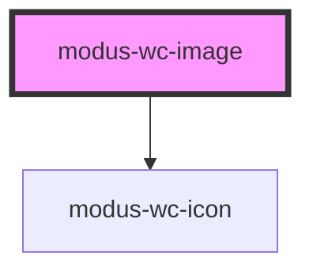

# modus-wc-image

<!-- Auto Generated Below -->

## Overview

A resilient atomic image component that wraps native  tags with consistent sizing,
aspect-ratio control, fallback error state, and full WCAG 2.2 accessibility support.

## Properties

| Property           | Attribute      | Description                                                             | Type                                                            | Default     |
| ------------------ | -------------- | ----------------------------------------------------------------------- | --------------------------------------------------------------- | ----------- |
| `alt`              | `alt`          | Accessible text description. Omit or leave empty for decorative images. | `string \| undefined`                                           | `undefined` |
| `customClass`      | `custom-class` | Custom CSS class to apply to the component.                             | `string \| undefined`                                           | `''`        |
| `fit`              | `fit`          | Controls containment, cropping, and aspect ratio preservation.          | `"contain" \| "default" \| "none" \| "scale-down" \| undefined` | `'default'` |
| `shape`            | `shape`        | Sets corner radius styling.                                             | `"rounded" \| "square" \| undefined`                            | `'square'`  |
| `size`             | `size`         | Determines dimensional size tokens.                                     | `"lg" \| "md" \| "sm" \| "xl" \| undefined`                     | `'md'`      |
| `src` _(required)_ | `src`          | The source URL of the image asset.                                      | `string`                                                        | `undefined` |

## Events

| Event        | Description                                      | Type                 |
| ------------ | ------------------------------------------------ | -------------------- |
| `imageError` | Event emitted when the image fails to load.      | `CustomEvent<Event>` |
| `imageLoad`  | Event emitted when the image loads successfully. | `CustomEvent<Event>` |

## Dependencies

### Depends on

- [modus-wc-icon](../modus-wc-icon)

### Graph

----------------------------------------------

*Built with [StencilJS](https://stenciljs.com/)*
