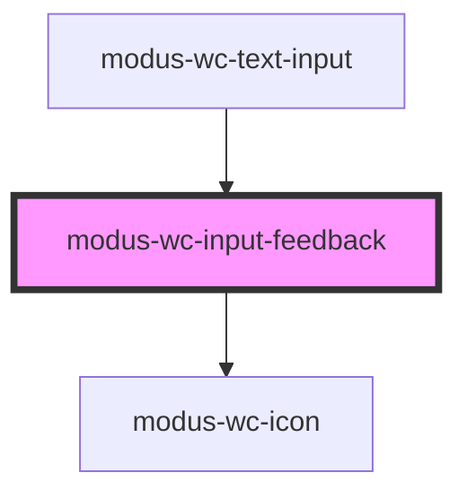

# modus-wc-input-feedback

<!-- Auto Generated Below -->

## Overview

A customizable feedback component used to provide additional context related to form input interactions.

<b>To use a custom icon, this component requires Modus icons to be installed in the host application. See [Modus Icon Usage](/docs/documentation-modus-icon-usage--docs) for steps.</b>

Adheres to WCAG 2.2 standards.

## Properties

| Property             | Attribute      | Description                                                   | Type                                          | Default     |
| -------------------- | -------------- | ------------------------------------------------------------- | --------------------------------------------- | ----------- |
| `customClass`        | `custom-class` | Custom CSS class to apply to the outer div element.           | `string \| undefined`                         | `''`        |
| `icon`               | `icon`         | The Modus icon to use instead of the pre-defined icons.       | `string \| undefined`                         | `''`        |
| `level` _(required)_ | `level`        | The level informs which icon and color that will be rendered. | `"error" \| "info" \| "success" \| "warning"` | `undefined` |
| `message`            | `message`      | The message.                                                  | `string \| undefined`                         | `''`        |
| `size`               | `size`         | The size of the feedback component.                           | `"lg" \| "md" \| "sm" \| undefined`           | `'md'`      |

## Dependencies

### Used by

 - [modus-wc-text-input](../modus-wc-text-input)

### Depends on

- [modus-wc-icon](../modus-wc-icon)

### Graph

----------------------------------------------

*Built with [StencilJS](https://stenciljs.com/)*
