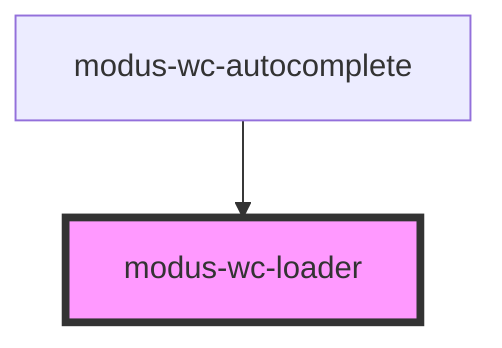

# modus-wc-loading

<!-- Auto Generated Below -->

## Overview

A customizable loader component used to indicate the loading of content

## Properties

| Property      | Attribute      | Description                                      | Type                                                                                               | Default     |
| ------------- | -------------- | ------------------------------------------------ | -------------------------------------------------------------------------------------------------- | ----------- |
| `color`       | `color`        | The color of the loader.                         | `"accent" \| "error" \| "info" \| "neutral" \| "primary" \| "secondary" \| "success" \| "warning"` | `'primary'` |
| `customClass` | `custom-class` | Custom CSS class to apply to the loader element. | `string \| undefined`                                                                              | `''`        |
| `size`        | `size`         | The size of the loader.                          | `"lg" \| "md" \| "sm" \| "xs"`                                                                     | `'md'`      |
| `variant`     | `variant`      | The variant of the loader.                       | `"ball" \| "bars" \| "dots" \| "infinity" \| "ring" \| "spinner"`                                  | `'spinner'` |

## Dependencies

### Used by

 - [modus-wc-autocomplete](../modus-wc-autocomplete)

### Graph

----------------------------------------------

*Built with [StencilJS](https://stenciljs.com/)*
