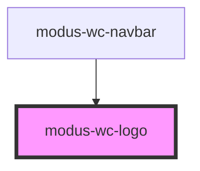

# modus-wc-logo

<!-- Auto Generated Below -->

## Overview

A component for displaying Trimble product logos with support for both fixed and scalable sizing.
Provides consistent branding across applications with various product logo options.
Logo colors automatically adapt to the active Modus theme via CSS variables.

## Properties

| Property            | Attribute      | Description                                                                                  | Type                                                                                                                                                                                                                                                                                                                                                                                                                                                                                                                                                                                                                                                                                                                                                                                                                                                                                                                                                                                                                                                                                                                                                                                                                                                                                                                                                                                                                                                                                                                                                                                                    | Default     |
| ------------------- | -------------- | -------------------------------------------------------------------------------------------- | ------------------------------------------------------------------------------------------------------------------------------------------------------------------------------------------------------------------------------------------------------------------------------------------------------------------------------------------------------------------------------------------------------------------------------------------------------------------------------------------------------------------------------------------------------------------------------------------------------------------------------------------------------------------------------------------------------------------------------------------------------------------------------------------------------------------------------------------------------------------------------------------------------------------------------------------------------------------------------------------------------------------------------------------------------------------------------------------------------------------------------------------------------------------------------------------------------------------------------------------------------------------------------------------------------------------------------------------------------------------------------------------------------------------------------------------------------------------------------------------------------------------------------------------------------------------------------------------------------- | ----------- |
| `alt`               | `alt`          | The alt text for accessibility. If not provided, defaults to the logo name.                  | `string \| undefined`                                                                                                                                                                                                                                                                                                                                                                                                                                                                                                                                                                                                                                                                                                                                                                                                                                                                                                                                                                                                                                                                                                                                                                                                                                                                                                                                                                                                                                                                                                                                                                                   | `undefined` |
| `customClass`       | `custom-class` | Custom CSS class to apply to the logo container.                                             | `string \| undefined`                                                                                                                                                                                                                                                                                                                                                                                                                                                                                                                                                                                                                                                                                                                                                                                                                                                                                                                                                                                                                                                                                                                                                                                                                                                                                                                                                                                                                                                                                                                                                                                   | `''`        |
| `emblem`            | `emblem`       | Show emblem version (icon only) instead of full logo                                         | `boolean \| undefined`                                                                                                                                                                                                                                                                                                                                                                                                                                                                                                                                                                                                                                                                                                                                                                                                                                                                                                                                                                                                                                                                                                                                                                                                                                                                                                                                                                                                                                                                                                                                                                                  | `false`     |
| `name` _(required)_ | `name`         | The name of the logo to display. Accepts values like 'trimble', 'viewpoint_field_view', etc. | `"accubid_anywhere" \| "accubid_classic" \| "advanced_image_manager" \| "analytics" \| "app_xchange" \| "appian" \| "atlas" \| "autobid" \| "b2w" \| "buildable_content" \| "business_center" \| "connect" \| "connect2fab" \| "copilot" \| "demand_planning" \| "earthworks" \| "estimation_construct" \| "estimation_desktop" \| "fabrication" \| "fabshop" \| "field_points" \| "fieldlink" \| "financials" \| "geosuite" \| "infrastructure" \| "innovative" \| "livecount" \| "materials" \| "modus" \| "modus_blueprint" \| "nova" \| "novapoint" \| "pay" \| "pc_miler" \| "prodesign" \| "projectsight" \| "quadri" \| "reality_capture" \| "sitevision" \| "siteworks" \| "sketchup" \| "sketchup_for_schools" \| "sketchup_go" \| "smart_workflow" \| "stabicad" \| "supplier_xchange" \| "sysque" \| "tekla" \| "tekla_structures" \| "terraflex" \| "tms" \| "tmt" \| "tmw_suite" \| "trade_service" \| "trade_service_live" \| "traqspera" \| "trimble" \| "truckmate" \| "unity" \| "unity_adms" \| "unity_construct" \| "unity_field" \| "unity_maintain" \| "unity_permit" \| "winest" \| "worksmanager" \| "viewpoint" \| "viewpoint_analytics" \| "viewpoint_epayments" \| "viewpoint_estimating" \| "viewpoint_field_management" \| "viewpoint_field_time" \| "viewpoint_field_view" \| "viewpoint_financial_controls" \| "viewpoint_for_projects" \| "viewpoint_hr_management" \| "viewpoint_jobpac_connect" \| "viewpoint_procontractor" \| "viewpoint_spectrum" \| "viewpoint_spectrum_service_tech" \| "viewpoint_team" \| "viewpoint_vista" \| "viewpoint_vista_field_service"` | `undefined` |

## Dependencies

### Used by

 - [modus-wc-navbar](../modus-wc-navbar)

### Graph

----------------------------------------------

*Built with [StencilJS](https://stenciljs.com/)*
