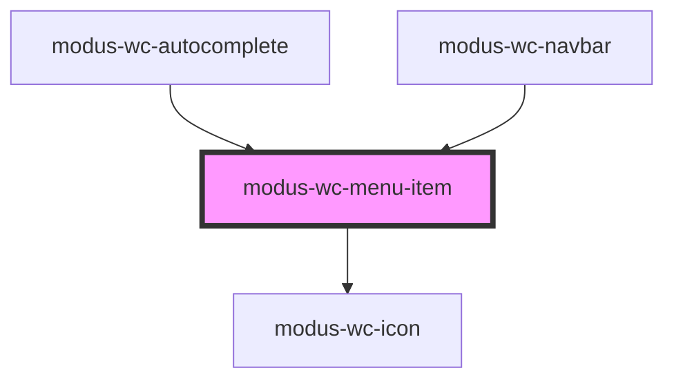

# modus-wc-menu-item

<!-- Auto Generated Below -->

## Overview

A customizable menu item component used to display the item portion of a menu.

Adheres to WCAG 2.2 standards.

## Properties

| Property      | Attribute      | Description                                                  | Type                                | Default     |
| ------------- | -------------- | ------------------------------------------------------------ | ----------------------------------- | ----------- |
| `bordered`    | `bordered`     |                                                              | `boolean \| undefined`              | `undefined` |
| `customClass` | `custom-class` | Custom CSS class to apply to the li element.                 | `string \| undefined`               | `''`        |
| `disabled`    | `disabled`     | The disabled state of the menu item.                         | `boolean \| undefined`              | `undefined` |
| `focused`     | `focused`      | The focused state of the menu item.                          | `boolean \| undefined`              | `undefined` |
| `label`       | `label`        | The text rendered in the menu item.                          | `string`                            | `''`        |
| `selected`    | `selected`     | The selected state of the menu item.                         | `boolean \| undefined`              | `undefined` |
| `size`        | `size`         | The size of the menu item.                                   | `"lg" \| "md" \| "sm" \| undefined` | `'md'`      |
| `startIcon`   | `start-icon`   | The modus icon name to render on the start of the menu item. | `string \| undefined`               | `undefined` |
| `subLabel`    | `sub-label`    | The text rendered beneath the label.                         | `string \| undefined`               | `undefined` |
| `value`       | `value`        | The unique identifying value of the menu item.               | `string`                            | `''`        |

## Events

| Event        | Description                                 | Type                              |
| ------------ | ------------------------------------------- | --------------------------------- |
| `itemSelect` | Event emitted when a menu item is selected. | `CustomEvent<{ value: string; }>` |

## Dependencies

### Used by

 - [modus-wc-autocomplete](../modus-wc-autocomplete)
 - [modus-wc-navbar](../modus-wc-navbar)

### Depends on

- [modus-wc-icon](../modus-wc-icon)

### Graph

----------------------------------------------

*Built with [StencilJS](https://stenciljs.com/)*
