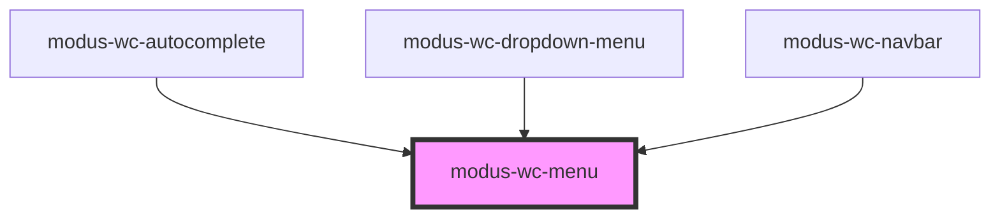

# modus-wc-menu

<!-- Auto Generated Below -->

## Overview

A customizable menu component used to display a list of li elements vertically or horizontally.

The component supports a `<slot>` for injecting custom li elements inside the ul element.

## Properties

| Property      | Attribute      | Description                                       | Type                                      | Default      |
| ------------- | -------------- | ------------------------------------------------- | ----------------------------------------- | ------------ |
| `bordered`    | `bordered`     | Indicates that the menu should have a border.     | `boolean \| undefined`                    | `undefined`  |
| `customClass` | `custom-class` | Custom CSS class to apply to the ul element.      | `string \| undefined`                     | `''`         |
| `isSubMenu`   | `is-sub-menu`  | Indicates that this menu is a submenu (dropdown). | `boolean \| undefined`                    | `undefined`  |
| `orientation` | `orientation`  | The orientation of the menu.                      | `"horizontal" \| "vertical" \| undefined` | `'vertical'` |
| `size`        | `size`         | The size of the menu.                             | `"lg" \| "md" \| "sm" \| undefined`       | `'md'`       |

## Events

| Event          | Description                              | Type                      |
| -------------- | ---------------------------------------- | ------------------------- |
| `menuFocusout` | Event emitted when the menu loses focus. | `CustomEvent<FocusEvent>` |

## Dependencies

### Used by

 - [modus-wc-autocomplete](../modus-wc-autocomplete)
 - [modus-wc-dropdown-menu](../modus-wc-dropdown-menu)
 - [modus-wc-navbar](../modus-wc-navbar)

### Graph

----------------------------------------------

*Built with [StencilJS](https://stenciljs.com/)*
