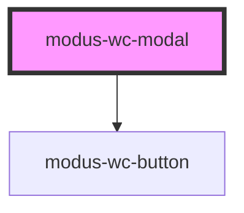

# modus-wc-modal

<!-- Auto Generated Below -->

## Overview

A customizable modal component used to display content in a dialog.

The component supports `<slot>` called 'header', 'content', and 'footer' for injecting custom HTML.

## Properties

| Property               | Attribute                | Description                                                                                                                | Type                                         | Default     |
| ---------------------- | ------------------------ | -------------------------------------------------------------------------------------------------------------------------- | -------------------------------------------- | ----------- |
| `backdrop`             | `backdrop`               | The modal's backdrop. Specify 'static' for a backdrop that doesn't close the modal when clicked outside the modal content. | `"default" \| "static" \| undefined`         | `'default'` |
| `customClass`          | `custom-class`           | Custom CSS class to apply                                                                                                  | `string \| undefined`                        | `''`        |
| `fullscreen`           | `fullscreen`             | Specifies whether the modal should be displayed full-screen                                                                | `boolean \| undefined`                       | `false`     |
| `modalId` _(required)_ | `modal-id`               | The ID of the inner dialog element                                                                                         | `string`                                     | `undefined` |
| `position`             | `position`               | Specifies the position of the modal                                                                                        | `"bottom" \| "center" \| "top" \| undefined` | `'center'`  |
| `showClose`            | `show-close`             | Specifies whether to show the close icon button at the top right of modal                                                  | `boolean \| undefined`                       | `true`      |
| `showFullscreenToggle` | `show-fullscreen-toggle` | Specifies whether to show the fullscreen toggle icon button                                                                | `boolean \| undefined`                       | `false`     |

## Dependencies

### Depends on

- [modus-wc-button](../modus-wc-button)

### Graph

----------------------------------------------

*Built with [StencilJS](https://stenciljs.com/)*
